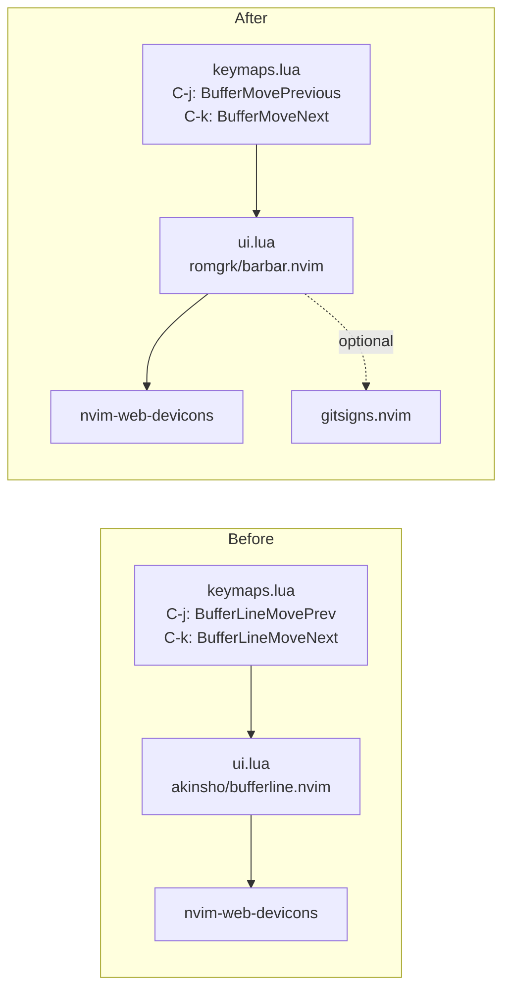

# 実装計画: bufferline.nvim から barbar.nvim への置き換え

## 元Issue
- #10: [Feature] バッファラインを bufferline.nvim から barbar.nvim に置き換える
- https://github.com/ryuma-1/dotfiles/issues/10

## 概要
`nvim/lua/plugins/ui.lua` のバッファライン定義を `akinsho/bufferline.nvim` から `romgrk/barbar.nvim` に差し替える．
`nvim/lua/config/keymaps.lua` の `<C-j>` / `<C-k>` を barbar の並べ替えコマンドに置き換える．
これで並べ替えキーマップが同等に動くようにする．
複雑度は単純．変更は実質 2 ファイル（+ `lazy-lock.json` の自動更新）で，レイヤー跨りや既存インターフェースの変更はない．

## 要件
- barbar.nvim によってバッファラインが表示される．
- bufferline.nvim が削除されている（プラグイン定義と lock エントリ）．
- `<C-j>` / `<C-k>` によるバッファの並べ替えが，barbar で同等に動作する．
- 新規依存は Issue が要求する barbar.nvim のみ．
- コメントは英語で書き，日本語コメントは「，」「．」を使う．主要な構造の前には doc comment を付ける．
- 既存の動作しているコードのうち，Issue に無いものはリファクタしない．

## 調査結果（現状）
- `nvim/lua/plugins/ui.lua:41-47` に bufferline の定義がある．
  - `event = 'VimEnter'`
  - `dependencies = { 'nvim-tree/nvim-web-devicons' }`
  - `opts = { options = { separator_style = 'padded_slant' } }`
- `nvim/lua/config/keymaps.lua:47-48` に `BufferLineMovePrev` / `BufferLineMoveNext` の割り当てがある．
  - 46 行目のコメントは「Ctrl+j/k: バッファの並び替え (VSCode ...)」．
  - `<C-h>` / `<C-l>` は `:bprevious` / `:bnext` で，bufferline に依存しないため変更不要．
- `BufferLine*` などの参照は，上記 2 箇所と `nvim/lazy-lock.json:4` にある．ハイライトやカラースキーム側の bufferline 連携（`monokai-pro` の `override` など）は見当たらない．
- `nvim-web-devicons` は導入済み（`lazy-lock.json:41`，`lualine` / `lsp.lua` でも使用）．新規依存にはならない．
- `gitsigns.nvim` も導入済み（`plugins/git.lua`，`event = 'VeryLazy'`）．barbar は Git ステータス表示に gitsigns を任意で使う．追加導入は不要．
- `nvim-tree.lua` は `plugins/edit.lua` にあり，`keys` で遅延読み込みされる．barbar は既定で NvimTree のオフセットを自動対応する（`sidebar_filetypes`）．
- `nvim-bufdel`（`plugins/edit.lua`，`<leader>ww` など）は bufferline に依存していない．barbar と併用できる見込みだが，動作確認の対象にする．

## 実装方針
1. `ui.lua` のバッファライン定義を barbar に置き換える．
   - `'romgrk/barbar.nvim'`，`event = 'VimEnter'`．
   - `dependencies = { 'nvim-tree/nvim-web-devicons', 'lewis6991/gitsigns.nvim' }`（どちらも導入済み）．
   - `opts` を使い，`init` で `vim.g.barbar_auto_setup = false` を設定して二重セットアップを避ける．
   - 見た目の設定は最小限にする（`animation = true` は既定のまま）．`separator_style = 'padded_slant'` 相当の設定は barbar に無いので既定を使う．
2. `keymaps.lua` の `<C-j>` を `<CMD>BufferMovePrevious<CR>` に，`<C-k>` を `<CMD>BufferMoveNext<CR>` にする（Prev が左，Next が右の意味を維持）．
3. `nvim --headless "+Lazy! sync" +qa` を実行し，`lazy-lock.json` を自動更新する（手動編集しない）．
4. コメントは英語で why を書く（例: barbar の auto setup を止める理由）．

## 構成の変化

## タスク一覧
### プラグイン定義（`nvim/lua/plugins/ui.lua`）
- [x] `akinsho/bufferline.nvim` のブロックを削除し，`romgrk/barbar.nvim` の定義に置き換える．
- [x] `init` で `vim.g.barbar_auto_setup = false` を設定する．
- [x] `dependencies` に `nvim-web-devicons` と `gitsigns.nvim` を指定する．
- [x] 「バッファライン」のコメント見出しは維持し，why を説明する英語の doc comment を付ける．

### キーマップ（`nvim/lua/config/keymaps.lua`）
- [x] 47 行目を `BufferMovePrevious` に変更する．
- [x] 48 行目を `BufferMoveNext` に変更する．
- [x] 46 行目のコメントはそのまま維持する．

### lock ファイル
- [x] `nvim --headless "+Lazy! sync" +qa` を実行し，`nvim/lazy-lock.json` の `bufferline.nvim` を削除して `barbar.nvim` を追加する．

### 動作確認
- [x] `nvim --headless "+Lazy! sync" +qa` がエラーなく終わること．
- [x] `nvim --headless "+lua vim.wait(500)" +qa 2>&1` に stderr の出力が無いこと．
- [x] `grep -rn "bufferline\|BufferLine" nvim/` が 0 件であること．
- [x] `pcall(require,'barbar')` が成功し，`pcall(require,'bufferline')` が失敗すること．
- [x] `vim.fn.exists(':BufferMoveNext')` / `vim.fn.exists(':BufferMovePrevious')` が 2 を返すこと．
- [x] `maparg('<C-j>','n')` が `BufferMovePrevious` を，`maparg('<C-k>','n')` が `BufferMoveNext` を含むこと．
- [x] 手動確認（ユーザー）: バッファライン表示，`<C-h>/<C-l>` 切り替え，`<C-j>/<C-k>` 並べ替え，NvimTree との重なり，nvim-bufdel，Monokai Pro での見た目，ダッシュボード/ターミナル表示．

## リスク・確認事項
- `separator_style = 'padded_slant'` 相当の設定は barbar に無い．見た目の変化は Issue の動機に沿うので既定値を使う．
- barbar の `auto_setup` と lazy.nvim の `opts` による二重 `setup()` は `init` での無効化で回避する．
- `event = 'VimEnter'` で起動時に開いたバッファが表示に反映されない場合は，`event` を調整する．
- Monokai Pro で色が崩れた場合の対応は Issue の範囲外（必要なら別 Issue）．
