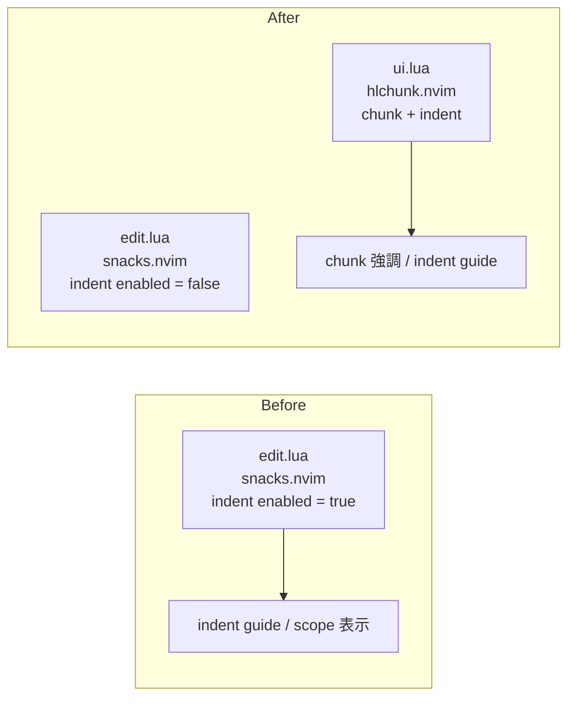

# 実装計画: インデント表示を snacks.nvim の indent から hlchunk.nvim に置き換え

## 元Issue
- #11: [Feature] インデント表示を snacks.nvim の indent から hlchunk.nvim に置き換える
- https://github.com/ryuma-1/dotfiles/issues/11

## 概要
`nvim/lua/plugins/edit.lua` の snacks.nvim にある `indent = { enabled = true }` を無効化する．
代わりに `shellRaining/hlchunk.nvim` を導入し，カーソル位置のチャンク強調とインデントガイドを hlchunk.nvim に一本化する．
複雑度は単純．変更は実質 2 ファイルで，`lazy-lock.json` は自動更新される．レイヤー跨りや既存インターフェースの変更はない．

## 要件
- hlchunk.nvim によってカーソル位置のチャンクが強調表示される．
- snacks.nvim の indent 機能が無効化され，表示が hlchunk.nvim に一本化される．
- 新規依存は Issue が要求する hlchunk.nvim のみ．
- コメントは英語で書き，主要な構造の前に doc comment を付け，why を説明する．インラインコメントはコードの上の行に置く．日本語コメントは「，」「．」を使う．
- Issue に無い既存設定（snacks の他機能など）はリファクタしない．README やドキュメントは変更しない．

## 調査結果（現状）
- `nvim/lua/plugins/edit.lua:139` に `indent = { enabled = true }` がある．snacks.nvim は `lazy = false` で読み込まれる．
- 同じ `opts` 内で `explorer` / `scroll` は `enabled = false` と明示されている．indent も削除ではなく `enabled = false` にすると，この書き方に揃う．
- `Snacks.indent` の参照はキーマップ・トグル・autocmd に無い．`Snacks.toggle` は diagnostics と inlay_hints のみ．
- `edit.lua:144` の `scope = { enabled = true }` は indent とは別モジュールなので，Issue の範囲外として触らない．
- `indent-blankline` / `mini.indentscope` など他のインデント表示系プラグインは無い．`vim.opt` 系の indent 設定は表示に関係ない．
- `nvim/lazy-lock.json` に `hlchunk` のエントリは無く，`snacks.nvim` は 47 行目にある．hlchunk は Lazy sync で追加される．
- `statuscolumn` は snacks のものが有効．hlchunk の `line_num` は既定で無効のままにすれば競合しない．

## 実装方針
1. hlchunk.nvim の定義を追加する．配置先は `nvim/lua/plugins/ui.lua` を第一候補とする．
   - `'shellRaining/hlchunk.nvim'`，`event = { 'BufReadPre', 'BufNewFile' }` で遅延読み込みする．
   - `opts = { chunk = { enable = true }, indent = { enable = true } }`．
   - `chunk` はカーソル位置の強調，`indent` は snacks indent が担っていたインデントガイドの代替となる．
   - `line_num` / `blank` は Issue に無いので既定（無効）のままにする．
2. `edit.lua` の snacks `opts` で `indent = { enabled = false }` にする．
3. `nvim --headless "+Lazy! sync" +qa` を実行し，`lazy-lock.json` を自動更新する（手動編集しない）．
4. コメントは英語で why を書く．例: snacks indent と描画が二重にならないようにするため，など．

## 構成の変化

## タスク一覧
### プラグイン定義
- [x] `nvim/lua/plugins/ui.lua` に `shellRaining/hlchunk.nvim` を追加する．
  - `event` は `BufReadPre` / `BufNewFile`．
  - `opts` は `chunk.enable = true` と `indent.enable = true`．
  - 英語の doc comment を付け，why を書く．
- [x] `nvim/lua/plugins/edit.lua:139` を `indent = { enabled = false }` に変更する．

### lock ファイル
- [x] `nvim --headless "+Lazy! sync" +qa` を実行し，`nvim/lazy-lock.json` に `hlchunk.nvim` を追加する．

### 動作確認
- [x] `nvim --headless "+Lazy! sync" +qa` がエラーなく終わること．
- [x] `nvim --headless "+lua vim.wait(500)" +qa 2>&1` に stderr の出力が無いこと．
- [x] `pcall(require,'hlchunk')` が成功すること．
- [x] `require('snacks').config.indent.enabled` が false であること（`Snacks.indent.enabled` が false でもよい）．
- [x] `grep -rn "Snacks.indent\|indent = { enabled" nvim/` で snacks indent が有効な箇所が 0 件であること．
- [x] 手動確認（ユーザー）: カーソル位置のチャンク強調，インデントガイドが二重描画されないこと，Markdown / Lua / ダッシュボード / ターミナルでの表示，Monokai Pro での色．

## リスク・確認事項
- hlchunk の `indent` も有効にするか，`chunk` のみにするかは Issue に明記されていない．Issue 本文が「インデント・チャンク表示」を置き換える趣旨なので，両方有効にする前提とする．
- 配置先は `ui.lua` を想定しているが，`edit.lua` に置くほうがよければ調整する．
- `scope = { enabled = true }` は残す．snacks の scope は indent と別機能で，Issue の対象外．
- snacks の `dashboard` / `terminal` / `notifier` 等のバッファで hlchunk の描画が邪魔になる場合は，`exclude_filetypes` の調整が必要になる可能性がある（既定の除外で問題が出た場合のみ）．
- Monokai Pro で hlchunk の色が見づらい場合の調整は，Issue の範囲外（必要なら別 Issue）．
