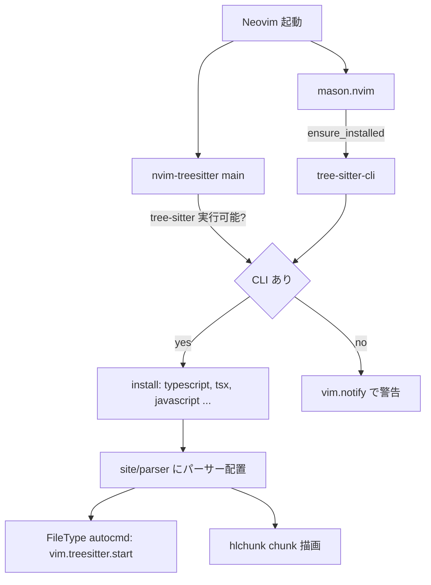

# 実装計画: nvim-treesitter (main) のパーサー自動インストールと tree-sitter-cli 導入

## 元Issue
- #15: [Bug] Tree-sitter パーサーがインストールされず TypeScript で hlchunk の chunk が表示されない
- https://github.com/ryuma-1/dotfiles/issues/15

## 概要
nvim-treesitter の `main` ブランチは `tree-sitter` CLI が無いとパーサーをビルドできない．この環境には CLI が無く，`:TSInstall` が失敗して `~/.local/share/nvim/site/parser/` が空になっている．
そのため `.ts` で Tree-sitter ハイライトと hlchunk の chunk（内部で `NO_TS`）が動かない．
`tree-sitter-cli` を dotfiles 側で自動導入し，必要パーサーを自動インストールする設定を追加して解消する．

## 要件
- TypeScript / TSX / JavaScript などのパーサーがインストールされ，`:checkhealth nvim-treesitter` の「Installed languages」に表示されること．
- `.ts` で Tree-sitter ハイライトと hlchunk.nvim の chunk 強調が有効になること．
- 必要パーサーを dotfiles 側で自動インストールする設定を検討する．
- 環境は NVIM v0.12.2 で nvim-treesitter は `main` ブランチ．`gcc` / `curl` / `tar` はあり，`tree-sitter` は無い．
- nvim-treesitter README の要件は次のとおり．
  - `tree-sitter-cli` 0.26.1 以上．
  - パッケージマネージャ経由で入れ，**npm は不可**．
  - C コンパイラ，`tar`，`curl`．
- 既存の FileType での `pcall(vim.treesitter.start)` は維持する．
- 変更箇所は主に `/home/ikeda-r/git/dotfiles/nvim/lua/plugins/lsp.lua` の Treesitter spec．
- コードコメントは英語で書き，主要な構造には doc comment を付ける．

## 実装方針
原因と対処は次のとおり．
- 原因は tree-sitter-cli の未導入．設定側にバグがあるわけではない．
- 導入手段は Mason の `tree-sitter-cli` パッケージを第一候補とする．
  - 理由は，既に `mason.nvim` と `mason-lspconfig` の `ensure_installed` による自動導入の前例があり，新規依存が増えないこと．
  - Mason のバイナリは `~/.local/share/nvim/mason/bin` に置かれ，Mason が PATH に追加する．
  - `nvim-treesitter` の実行時にこの PATH が効いているかを確認する必要がある．
  - Mason のパッケージ版が 0.26.1 以上であることも確認する．
- 代替案は `cargo install tree-sitter-cli`．cargo は使えるが，ビルドに時間がかかる．
  - 次に prebuilt バイナリを使う案がある．
  - npm は README で非推奨なので採用しない．
- パーサーの自動インストールは `require('nvim-treesitter').install({...})` を使う．
  - 実行は tree-sitter-cli の導入後に行う．Mason の非同期導入と競合しないよう，`tree-sitter` の実行可能チェックを挟む．
  - CLI が未導入の間は，パーサーのインストールを黙って失敗させず，`vim.notify` で警告する（エラーを握りつぶさない）．
  - 既にインストール済みなら no-op なので，起動ごとに呼んでよい．
- 対象パーサーは，まず issue 記載の `typescript`，`tsx`，`javascript` とする．
  - このconfig で使用している言語（`lua`，`markdown`，`markdown_inline` など）は，最小限に留めるか追加するかを確認事項に挙げる．
- 現状の spec の `lazy = false` と `build = ':TSUpdate'` は維持する．

## 構成の変化

## タスク一覧
### 調査（実装前の確認）
- [x] `~/.local/share/nvim/lazy/nvim-treesitter/lua/nvim-treesitter/install.lua` と `config.lua` を読み，`install()` の挙動を確認する．
  - 確認する点は，CLI 不在時のエラー，戻り値（`:wait()` 可否），パーサー名（`tsx` を含む）．
- [x] Mason レジストリに `tree-sitter-cli` があり，バージョンが 0.26.1 以上であることを確認する．
- [x] Mason 経由のバイナリが nvim-treesitter から見えるか確認する（`vim.fn.executable('tree-sitter')`）．
- [x] `/home/ikeda-r/git/dotfiles/nvim/lua/plugins/ui.lua` の hlchunk 設定が，どのパーサー・クエリに依存するかを確認する．

### 実装（`/home/ikeda-r/git/dotfiles/nvim/lua/plugins/lsp.lua`）
- [x] Mason 側に `tree-sitter-cli` の自動導入を追加する．
  - 方法は，`mason-tool-installer` のような新規依存を避け，Mason 標準 API（`mason-registry`）で未導入時のみインストールする形にする．
  - 新規プラグインの追加はしない．
- [x] Treesitter spec の `config` に，パーサー一覧を定数（doc comment 付き）として定義する．
- [x] CLI が使える状態になってから `require('nvim-treesitter').install(...)` を呼ぶ処理を追加する．
  - Mason のインストール完了後に実行する．
  - すでに CLI がある環境ではそのまま実行する．
- [x] CLI 不在で失敗した場合は `vim.notify` で警告する．
- [x] 既存の FileType autocmd（`pcall(vim.treesitter.start)`）は維持する．
- [x] コメントは英語で，why を説明する．インラインコメントは対象行の上に置く．

### 反映・検証
- [x] Neovim を再起動する，または `:Lazy sync` の後に，`tree-sitter-cli` の導入とパーサーのビルドを完了させる．
- [x] `tree-sitter` が実行可能であること（`:echo executable('tree-sitter')`）を確認する．
- [x] `~/.local/share/nvim/site/parser/` に `typescript.so`，`tsx.so`，`javascript.so` が生成されていることを確認する．
- [x] `:checkhealth nvim-treesitter` で ERROR が消え，「Installed languages」にパーサーが表示されることを確認する．
- [x] `.ts` を開き，`:InspectTree` または `:lua print(vim.treesitter.highlighter.active[vim.api.nvim_get_current_buf()] ~= nil)` でハイライトが有効なことを確認する．
- [x] `.ts` のブロック内にカーソルを置き，hlchunk の chunk が描画されることを確認する．
- [x] `nvim/lazy-lock.json` に差分が出る場合は，意図した範囲かを確認してからコミットに含める．
- [x] クリーン環境（パーサーと Mason のデータが無い状態）で初回起動して再確認する．

## リスク・確認事項
- Mason の `tree-sitter-cli` がバージョン要件（0.26.1 以上）を満たさない場合は，cargo か prebuilt バイナリに切り替える必要がある．
- Mason のインストールは非同期なので，初回起動時にパーサーのインストールが CLI 導入より先に走る競合が起こりうる．順序制御の設計が必要．
- 初回起動では，パーサーのビルドで数分かかる可能性がある．
- パーサー一覧の範囲は要確認．issue 記載の3つのみにするか，`lua`，`markdown`，`markdown_inline`，`rust`，`c_sharp` など既存 config で使う言語も含めるか．issue に無い機能は追加しない方針なので，最小構成を基本とする．
- 旧構成の `/home/ikeda-r/git/dotfiles/init.lua`（438 行付近）にも同じ Treesitter 設定が残っている．今回のスコープ（`nvim/lua/plugins/lsp.lua`）に含めるか要確認．
- README などにセットアップ要件（tree-sitter-cli）を追記するとよい可能性があるが，ドキュメント変更は許可が必要なため，タスクには含めていない．必要なら別途許可を得る．
- Neovim 0.12 の stable / nightly 前提であり，将来 nvim-treesitter の API が変わる可能性がある．

関連ファイル
- `/home/ikeda-r/git/dotfiles/nvim/lua/plugins/lsp.lua`
- `/home/ikeda-r/git/dotfiles/nvim/lua/plugins/ui.lua`
- `/home/ikeda-r/git/dotfiles/nvim/lazy-lock.json`
- `/home/ikeda-r/git/dotfiles/init.lua`
- `/home/ikeda-r/.local/share/nvim/lazy/nvim-treesitter/README.md`
