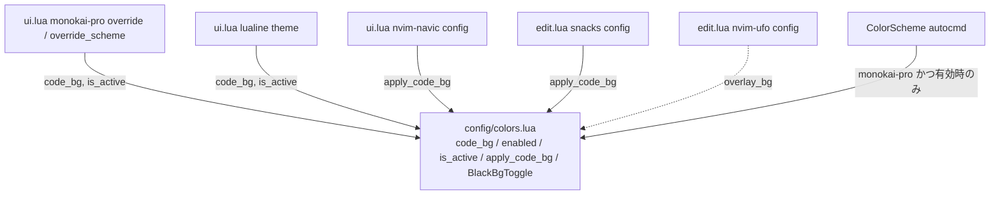

# 実装計画: 黒背景色を colors.lua に集約し monokai-pro 使用時のみ適用（トグル可能）にする

## 元Issue
- #18: [Refactor] 黒背景色を colors.lua に集約し monokai-pro 使用時のみ適用（トグル可能）にする
- https://github.com/ryuma-1/dotfiles/issues/18

## 概要
ハードコードされた `#000000` を `nvim/lua/config/colors.lua` の `M.code_bg` に一本化します．黒背景の上書き処理も `colors.lua` 内の関数にまとめます．この関数は colorscheme が monokai-pro で，かつ有効状態のときだけ適用します．あわせて `:BlackBgToggle` で有効/無効を切り替えられるようにします．monokai-pro 使用時の見た目は現状と同一に保ちます．

## 要件
- 黒背景色は `config/colors.lua`（`M.code_bg`）の 1 箇所で定義し，各所はそれを参照する．
  - 対象は `ui.lua` の 29, 31, 39, 42, 44, 45, 49, 86, 87, 116 行目と，`edit.lua` の 261, 264 行目．
- 黒背景の上書きは `vim.g.colors_name == 'monokai-pro'` かつ有効状態のときのみ自動適用する．
- 他のカラースキームでは黒の上書きを一切適用せず，各テーマ本来の背景にする．
  - 現状は WinBar や SnacksPicker などが黒のまま残る．
- `:BlackBgToggle`（またはキー）でオン/オフできる．
- `override_scheme`（`editor.background` / `tab.activeBackground`）は monokai-pro 専用である．そのためトグル時は `colorscheme monokai-pro` を再読み込みして反映する．
- navic / ufo / snacks のように，プラグインの初回 require 時に monokai-pro が自前のハイライトを再適用するケースでは，各 config から共通関数を呼ぶ．現状のコメントにある理由は維持する．
- lualine テーマの `normal.c.bg` / `normal.x.bg` も同じ判定に従わせる．
- `overlay_bg` を使う `TreesitterContext` / `Folded` / `UfoFoldedBg` は monokai-pro の黒背景と対になる色なので，扱いは実装時に確認する（リスク参照）．

## 実装方針
1. `colors.lua` に `code_bg`，有効状態 `enabled`（初期値 true），判定関数 `is_active()` を追加する．
   - `is_active()` は `enabled and vim.g.colors_name == 'monokai-pro'` を返す．
2. 適用処理を `colors.lua` の関数 `apply_code_bg()` に集約する．
   - 対象グループは次のとおり．
     - `Normal`, `NormalNC`, `NormalFloat`, `WinBar`, `WinBarNC`
     - `SnacksPicker`, `SnacksPickerBorder`, `SnacksPickerTitle`, `SnacksPickerPrompt`, `SnacksPickerInputBorder`
   - 既存の fg を保つ必要があるグループは，現状どおり `nvim_get_hl(..., link=false)` で取得して bg のみ差し替える．
   - monokai-pro の `override` 経由で適用している分は，`override` 関数内で `colors.is_active()` により分岐させる．分岐の結果が `Normal` 系だけなら `apply_code_bg()` と二重にならないよう整理する．
3. `ColorScheme` autocmd を `colors.lua` に用意する．`is_active()` が真のときのみ `apply_code_bg()` を呼ぶ．
4. navic / snacks（および `UfoFoldedBg` の再適用）の各 config は，直接 `nvim_set_hl` する代わりに `is_active()` ガード付きで共通関数を呼ぶ．
5. lualine は theme 生成を関数化する．`is_active()` のときのみ `normal.c.bg` / `normal.x.bg` を `code_bg` にする．トグルや colorscheme 変更時に `lualine.setup` を再実行して反映する．
6. `:BlackBgToggle` は `enabled` を反転し，`colorscheme monokai-pro` を再読み込みする．
   - 現 colorscheme が monokai-pro 以外のときの挙動は，リスク参照．
   - 再読み込みで `ColorScheme` autocmd が走り，`override` / `override_scheme` / 共通関数が再評価される．
   - コマンド定義は，既存の `InlayHintToggle` と同様に `nvim_create_user_command` を使う．
7. monokai-pro の `setup` に渡す `override_scheme` / `override` は，`setup` 時点の `enabled` を見る．トグル時は `setup` を再実行してから `colorscheme monokai-pro` する（`override_scheme` 内の判定がクロージャで毎回評価されるなら再 setup は不要．実装時に確認）．
8. コメントは「why」を書き，主要な関数・テーブルの前に doc comment を付ける．日本語コメントは「，」「．」を使う．

## 構成の変化

## タスク一覧
### config/colors.lua
- [x] `M.code_bg = '#000000'` を doc comment 付きで追加する
- [x] 有効状態 `M.enabled`（初期 true）と `M.is_active()` を追加する
- [x] `M.apply_code_bg()` を実装する（Normal 系，WinBar 系，SnacksPicker 系．fg を保持するグループは bg のみ差し替え）
- [x] `ColorScheme` autocmd を追加する（`is_active()` が真のときのみ `apply_code_bg()` を呼ぶ）
- [x] `:BlackBgToggle` ユーザーコマンドを追加する（`enabled` 反転 → `colorscheme monokai-pro` 再読込．状態を通知する）
- [x] （任意）キーマップを割り当てる場合は，既存の `<leader>` 体系と衝突しないか確認する（Issue ではコマンドまたはキー）

### plugins/ui.lua
- [x] `override_scheme` の `#000000` を `colors.code_bg` に置換する．`is_active()` が偽のときは空テーブルを返す
- [x] `override` の `#000000` を `colors.code_bg` に置換する．`is_active()` が偽のときは黒関連を返さない
- [x] lualine の `my_theme` 生成を関数化する．`is_active()` に従って `normal.c.bg` / `normal.x.bg` を設定し，トグル時や colorscheme 変更時に再 setup する
- [x] nvim-navic の config で，直接の `nvim_set_hl` を `is_active()` ガード付きの共通関数呼び出しに置換する（コメントの理由は維持）

### plugins/edit.lua
- [x] snacks の config で，`#000000` の直接指定を共通関数呼び出しに置換する（`is_active()` ガード付き，コメント維持）
- [x] nvim-ufo の `UfoFoldedBg` 再適用の扱いを，`overlay_bg` のリスク判断に沿って調整する

### 検証
- [x] monokai-pro 起動時の見た目が現状と同一であることを確認する（Normal，NormalFloat，WinBar，bufferline，lualine，SnacksPicker，Folded）
- [x] 別 colorscheme（例: `:colorscheme habamax`）へ切替後，WinBar / SnacksPicker / lualine が黒のまま残らないことを確認する
- [x] `:BlackBgToggle` で off → on を往復し，各グループが追従することを確認する
- [x] リポジトリ内に `#000000` の直書きが `colors.lua` 以外に残っていないことを `Grep` で確認する
- [x] navic / ufo / snacks を遅延ロードさせた後（初回 require 後）も，想定の背景になっていることを確認する

## リスク・確認事項
- **`overlay_bg` の扱い**: `TreesitterContext` / `Folded` / `UfoFoldedBg` は monokai-pro の黒背景を前提とした色である．Issue は黒の上書きだけを対象としている．そのため，他テーマでも `overlay_bg` を適用し続けるのか，monokai-pro 限定にするのかを実装時に決める．
- **ufo は `code_bg` 参照ではない**: ufo は `overlay_bg` のみを使い，Issue の「`#000000` 12 箇所」には含まれない．ufo の config を変更するかは上記判断に依存する．
- **plugin 初回 require 時の再適用**: navic / snacks / ufo は初回 require 時に monokai-pro が自前でハイライトを再適用する．各 config からの共通関数呼び出しは，必ず `setup` 後に行う．
- **トグル時の再読込**: `colorscheme monokai-pro` の再読込は，現在 monokai-pro 以外のテーマ使用中に走ると意図せずテーマが切り替わる．その場合は再読込しない（状態のみ変更する），または通知のみにするかを決める．
- **lualine の再 setup**: トグル時のテーマ再構築が必要になる．`lualine.setup` の再実行で副作用がないか確認する．
- **tint.nvim との相互作用**: `tint.nvim` は各ハイライトのコピーを使う．`NormalNC` の bg が `Normal` と一致する前提が崩れないか確認する．
- **ファイル数の増加**: Issue が挙げる「ui.lua と edit.lua の 12 箇所」は，行番号ベースで集計されている．実装時に最新の出現箇所を再確認する．
