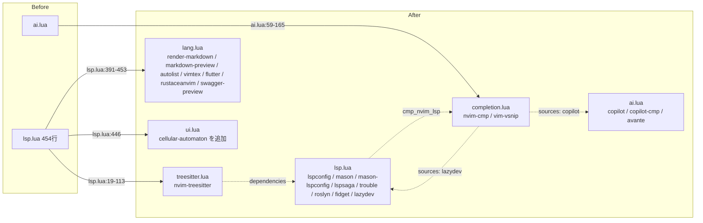

# 実装計画: lua/plugins 配下のプラグイン定義を役割ごとに再編成する

## 元Issue
- #19: [Refactor] lua/plugins 配下のプラグイン定義を役割ごとに再編成する
- https://github.com/ryuma-1/dotfiles/issues/19

## 概要
`nvim/lua/plugins/lsp.lua`（454 行）と `ai.lua` に同居している無関係なプラグイン spec を，役割ごとのファイルへ移動する．ファイル名からプラグインの所在を推測できる構成にする．プラグインの設定内容と挙動は変えない．複数ファイルに跨る移動だが，設計判断は配置先の決定が中心で，ロジック変更はない．複雑度は「中」（ファイル分割＋コメント追従）とする．

## 要件
- `lsp.lua`: lspconfig / mason / mason-lspconfig / lspsaga / trouble / roslyn（roslyn-filewatch 含む）/ fidget / lazydev のみにする．
- `treesitter.lua`（新規）: nvim-treesitter（と関連プラグイン）．
- `completion.lua`（新規）: nvim-cmp / vim-vsnip．
- `ai.lua`: copilot / copilot-cmp / avante のみにする．
- `lang.lua`（新規）: render-markdown / markdown-preview / autolist / vimtex / flutter-tools / rustaceanvim / swagger-preview．
- cellular-automaton は `ui.lua` に移す（ユーザー決定）．
- 他ファイルからの参照コメントを新しい配置に追従させる．
- プラグインの設定内容・挙動は変えない．
- 移動のみのコミットと内容変更のコミットを分け，差分をレビューしやすくする．

## 実装方針
### 調査結果
- `nvim/init.lua:53` は `require("lazy").setup("plugins", lazy_opt)` で `plugins` ディレクトリ全体を読み込む．新規ファイルは自動で読み込まれ，import 設定の変更は不要．
- `lsp.lua` 冒頭のローカル関数 `lsp_keybindings` は nvim-lspconfig の LspAttach 内（`lsp.lua:299`）でのみ使われる．lspconfig は `lsp.lua` に残るため，移動対象の spec は依存していない．
- `IsWSL` は `lua/config/base.lua:4` のグローバル変数で，vimtex の config（`lsp.lua:439`）が使う．`config.base` は lazy より先に読み込まれるため `lang.lua` に移しても問題ない．
- クロスファイル依存（いずれもプラグイン名による参照で，ファイルパスには依存しない）
  - nvim-cmp の `dependencies` に `zbirenbaum/copilot-cmp`，`sources` に `copilot` / `lazydev` がある．copilot-cmp は `ai.lua`，lazydev は `lsp.lua` に残る．
  - nvim-lspconfig の config は `require('cmp_nvim_lsp')` を呼ぶ（`lsp.lua:236`）．cmp-nvim-lsp は nvim-cmp の dependencies で `completion.lua` に移るが，関係は変わらない．
  - lspsaga → nvim-treesitter，nvim-treesitter → mason.nvim，avante → nvim-cmp / render-markdown の `dependencies` は名前参照なのでファイルを跨いでも動作する．
  - vim-vsnip は spec 本体を `completion.lua` へ丸ごと移すだけで，重複 spec にはならない．
- lazy.nvim は spec を全てマージしてから読み込むため，ファイル名順の変化による影響は基本的にない．

### ブランチ
- `main` から `issue-19-reorganize-plugins` を切る（ユーザー決定）．#18（PR #24，未マージ）も `ui.lua` を変更しているため，cellular-automaton 追加箇所は ui.lua の末尾など #18 の変更箇所から離れた位置にし，競合を最小化する．

### コミット分割
1. 移動のみのコミット（spec の本文は一字も変えない）
2. 参照コメントの追従コミット（`after/ftplugin/markdown.lua` 等）
3. 必要に応じて内容変更（セクションコメント整理など）のコミット

## 構成の変化

## タスク一覧
### 準備
- [x] `main` から作業ブランチ `issue-19-reorganize-plugins` を作成する
- [x] 移動前の spec 一覧を記録する（後述の headless コマンドでプラグイン名と主要属性を保存する）

### 移動のみのコミット
- [x] `nvim/lua/plugins/treesitter.lua` を新規作成し，`lsp.lua:18-113` の nvim-treesitter spec を移す
- [x] `nvim/lua/plugins/completion.lua` を新規作成し，`ai.lua:59-165` の vim-vsnip と nvim-cmp の spec を移す
- [x] `nvim/lua/plugins/lang.lua` を新規作成し，`lsp.lua` の rustaceanvim / flutter-tools / render-markdown / markdown-preview / autolist / vimtex / swagger-preview を移す
- [x] cellular-automaton を `ui.lua` の末尾へ移す
- [x] `lsp.lua` から移動済みの spec を削除し，`lsp_keybindings` は lspconfig 用として残す
- [x] `ai.lua` から移動済みの spec を削除する
- [x] 各ファイルのセクションコメントは元のまま移す（文言は変更しない）

### 参照コメントの追従
- [x] `nvim/after/ftplugin/markdown.lua:18` の `lua/plugins/ai.lua の cmp mapping 側` を `lua/plugins/completion.lua` に更新する
- [x] `nvim/after/ftplugin/markdown.lua:85` の `markdown-preview.nvim is declared in lua/plugins/lsp.lua` を `lua/plugins/lang.lua` に更新する
- [x] `nvim/lua/plugins/ui.lua:131` の「no on_attach wiring is needed in lsp.lua」は lspconfig を指すため変更不要であることを確認する
- [x] `nvim/` 内のコメントに，移動した spec への古い参照が残っていないか Grep で最終確認する
- [x] `docs/plans/` 配下の過去の計画書は履歴文書なので更新しない

### 検証
- [x] 構文チェック: `nvim --headless -c "lua for _,f in ipairs(vim.fn.glob('lua/plugins/*.lua',false,true)) do assert(loadfile(f)) end" -c qa`
- [x] 各 plugin ファイルが table を返すことを確認する
- [x] 起動エラーがないこと: `nvim --headless +qa` の stderr を確認する（`Lazy! sync` は実行しない）
- [x] spec の比較: headless で `require('lazy').plugins()` の名前と主要属性（`lazy` / `event` / `ft` / `cmd` / `dependencies`）を出力し，移動前後で差分がないことを確認する
- [x] `lazy-lock.json` に差分が出ていないことを確認する
- [x] `git diff -M --stat` で，移動のみのコミットに内容変更がないことを確認する
- [ ] 手動確認（ユーザー）: Markdown のインデント，補完（LSP／copilot／lazydev），スニペットジャンプ，`:MarkdownPreview`，`:CellularAutomaton`，Treesitter ハイライト

## リスク・確認事項
- `lazy = false` のプラグインの読み込み順がファイル名順の変更で変わる可能性がある（mason / treesitter / lspconfig / fidget）．依存は `dependencies` で明示されているため影響は小さい見込みだが，起動確認で見る．
- #18（PR #24）と `ui.lua` で競合しうる．後からマージされる側で解消する．
- nvim-treesitter → mason.nvim の依存は `treesitter.lua` と `lsp.lua` 間の暗黙の依存になる（機能上は問題なし）．

## 関連ファイル
- nvim/lua/plugins/lsp.lua
- nvim/lua/plugins/ai.lua
- nvim/lua/plugins/ui.lua
- nvim/after/ftplugin/markdown.lua
- nvim/init.lua
- nvim/lua/config/base.lua
