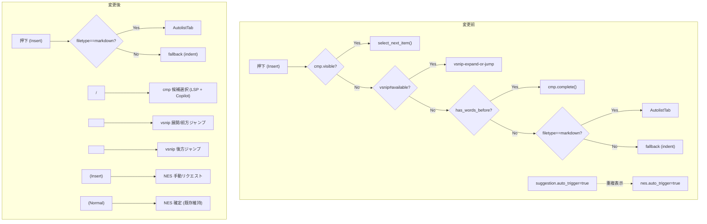
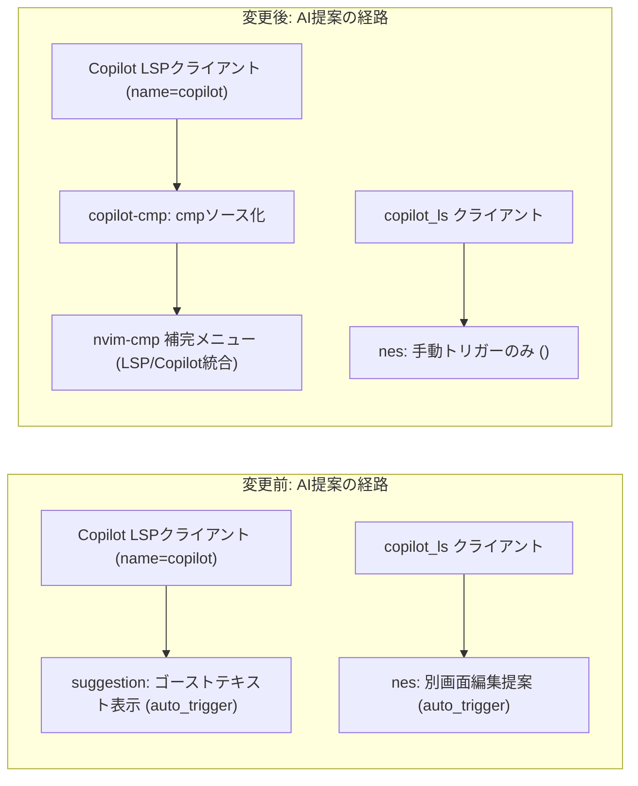

# 実装計画: Insert モードの `<Tab>` と AI 提案 (NES / インライン提案) の責務重複を解消する（確定版）

## 元Issue
- #2: [Bug] Tab キーと AI 提案（NES / インライン提案）の挙動が重複する
- https://github.com/ryuma-1/dotfiles/issues/2

## 概要
Neovim の Insert モードにおいて，`<Tab>` が「インデント調整」「LSP 補完候補の選択」「補完の手動トリガー」「vsnip スニペットジャンプ」「Markdown リストのインデント委譲」を一手に担っており，責務が重複・衝突している．また `copilot.lua` の `suggestion`（インライン提案）と `nes`（Next Edit Suggestions）が共に `auto_trigger = true` のため，AI 提案が同時に二重表示される．
本計画では，ユーザーの最終決定に基づき，AI提案は `copilot-cmp` 経由で nvim-cmp の補完メニューに統合し，`copilot.lua` 側のインライン提案（`suggestion`）は無効化，NES は自動発火を止めて手動トリガーに変更する．また `<Tab>`/`<S-Tab>` はインデント調整専用に戻し，候補選択は `<C-n>`/`<C-p>`，vsnip のジャンプは `<M-l>`/`<M-h>` に切り出す．

## 要件（ユーザーの最終決定）
1. AI提案は nvim-cmp の補完メニューに統合する
   - 新規プラグイン `zbirenbaum/copilot-cmp` を追加する（ユーザー明示承認済みの新規依存）
     - `dependencies = { "zbirenbaum/copilot.lua" }`
     - `event = 'InsertEnter'`
     - `config = function() require("copilot_cmp").setup() end`
   - `nvim-cmp` の `dependencies` に `'zbirenbaum/copilot-cmp'` を追加する
   - `nvim-cmp` の `sources` に `{ name = 'copilot' }` を `buffer` の後に追加する
2. `copilot.lua` のインライン提案（`suggestion`）は無効化する
   - `suggestion = { enabled = false }`
   - これに伴い `suggestion.keymap.accept ('<M-CR>')` と `accept_word ('<M-l>')` は設定ごと削除する
3. NES（`nes`）は有効のまま自動発火を止め，手動トリガーに変更する
   - `nes.enabled = true` を維持
   - `nes.auto_trigger = false` に設定
   - NES を1回だけ要求する手動トリガー用キーマップを追加する
   - 既存の Normal モード `<M-CR>` 確定キーマップはそのまま維持する
4. `<Tab>`/`<S-Tab>` はインデント調整専用に戻す
   - Markdown: `AutolistTab` / `AutolistShiftTab` を呼ぶ
   - それ以外: `fallback()`（ネイティブのインデント）
   - 候補選択（`select_next_item`/`select_prev_item`）・vsnip ジャンプ・`cmp.complete()` の手動トリガーの分岐は削除する
   - 上記削除の結果，`has_words_before` と `feedkey` が未使用になった場合は削除する
5. 補完候補の選択キーとして `<C-n>`/`<C-p>` を cmp mapping に追加する（`select_next_item`/`select_prev_item`）
6. vsnip のジャンプは `<M-l>`（展開 or 前方ジャンプ: `<Plug>(vsnip-expand-or-jump)`）／`<M-h>`（後方ジャンプ: `<Plug>(vsnip-jump-prev)`）に割り当てる（`i`/`s` モード）
7. `<Tab>` マッピング周辺のコメントと `after/ftplugin/markdown.lua` L14-16 のコメントを，実態に合わせて必要な範囲で更新する（日本語，「，」「．」を使用）

## 実装方針
以下の順で進める（各項目は独立して検証可能なため，順不同でも良いがこの順が依存関係として自然）．

1. `copilot.lua` の `suggestion`/`nes` 設定変更（要件2・3）
2. `copilot-cmp` プラグインの追加と `nvim-cmp` への source/dependency 追加（要件1）
3. `nvim-cmp` の `<Tab>`/`<S-Tab>` の責務縮小と `<C-n>`/`<C-p>` の追加（要件4・5）
4. vsnip 用 `<M-l>`/`<M-h>` の追加（要件6）
5. コメント更新（要件7）
6. 手動検証（`## 検証` 参照）

### 各変更の詳細と根拠

#### 1. `suggestion` 無効化と `nes` 手動化 (`nvim/lua/plugins/ai.lua` L8-32付近)
- `suggestion = { enabled = false }` に変更し，`keymap.accept`/`keymap.accept_word` の記述ごと削除する
  - 根拠: `copilot-cmp` の README にも「`suggestion`/`panel` を無効化することが推奨される（cmp 側の補完表示と競合するため）」と明記されており，`panel` は本リポジトリで既に `enabled = false` 済みのため，`suggestion` 側を合わせることで README の推奨構成と一致する
  - 補足: `suggestion.enabled = false` にしても，Copilot 本体の LSP クライアント（クライアント名 `copilot`）自体の起動は `copilot.command.enable()` 側で行われており `suggestion.enabled` に依存しないため，`copilot-cmp` がこのクライアントに source として接続する動作に支障はない（`copilot-cmp` は内部で `vim.lsp.get_clients({ name = "copilot" })` を参照してソース登録する実装になっている）
- `nes.auto_trigger = false` に変更（`nes.enabled = true` は維持）
- NES 手動トリガー用キーマップを追加する
  - 実装: `copilot-lsp` が公開する `require('copilot-lsp.nes').request_nes(client_name_or_client)` を直接呼び出す
    ```lua
    -- Option+n で Next Edit Suggestion を手動リクエストする (auto_trigger を無効化したため)
    -- copilot.lua の nes_api には手動リクエスト用の関数が公開されていないため，
    -- copilot-lsp の内部関数を直接呼び出す (内部API依存のリスクは下記「リスク・確認事項」参照)
    vim.keymap.set('i', '<M-n>', function()
        require('copilot-lsp.nes').request_nes('copilot_ls')
    end, { silent = true, desc = 'Copilot: Request Next Edit Suggestion (manual)' })
    ```
  - キー選定: `<M-n>`（Alt+n，"Next edit" の n）を採用．リポジトリ内の既存キーマップ（`lua/config/keymaps.lua`・`lua/plugins/lsp.lua`・`lua/plugins/edit.lua`・`lua/plugins/ai.lua`）を確認した結果，`<M-n>` はどのモードでも未使用であることを確認済み
  - `copilot_ls` はインストール済み `copilot-lsp/lsp/copilot_ls.lua` で定義されている LSP クライアント名であり，`request_nes` は文字列を渡すとその名前で `vim.lsp.get_clients()` を検索して呼び出す実装になっているため，クライアントインスタンスを別途保持する必要はない
  - 既存の Normal モード `<M-CR>` 確定キーマップ（L36-41）はそのまま維持する（`nes.enabled = true` のままなので動作要件は変わらない）

#### 2. `copilot-cmp` の追加 (`nvim/lua/plugins/ai.lua`)
- Copilot プラグインブロックの並びに新規スペックを追加
  ```lua
  {
      "zbirenbaum/copilot-cmp",
      dependencies = { "zbirenbaum/copilot.lua" },
      event = 'InsertEnter',
      config = function()
          require("copilot_cmp").setup()
      end,
  },
  ```
- `nvim-cmp` スペックの `dependencies`（現L57-61）に `'zbirenbaum/copilot-cmp'` を追加
- `sources`（現L106-110）の `buffer` の直後に `{ name = 'copilot' }` を追加
  ```lua
  sources = cmp.config.sources({
      { name = 'nvim_lsp' }, { name = 'vsnip' }, { name = 'path' },
      { name = 'buffer', keyword_length = 3 },
      { name = 'copilot' },
      { name = 'calc' }, { name = "lazydev", group_index = 0 },
  }),
  ```

#### 3. `<Tab>`/`<S-Tab>` の縮小と `<C-n>`/`<C-p>` 追加 (`nvim/lua/plugins/ai.lua` L78-93付近)
```lua
-- <Tab>/<S-Tab> はインデント調整専用とし，補完候補の選択や
-- 補完の手動トリガー，vsnip のジャンプとは責務を分離する
-- (これらを <Tab> に混在させると，インデント操作と AI/LSP の提案操作が
--  同じキーで衝突するため．候補選択は <C-n>/<C-p>，
--  vsnip のジャンプは <M-l>/<M-h> に割り当てる)
["<Tab>"] = cmp.mapping(function(fallback)
    -- Markdown はリスト・チェックボックスのインデント変更を autolist.nvim に委譲する
    if vim.bo.filetype == 'markdown' then vim.cmd('AutolistTab')
    else fallback() end
end, { 'i', 's' }),
["<S-Tab>"] = cmp.mapping(function(fallback)
    if vim.bo.filetype == 'markdown' then vim.cmd('AutolistShiftTab')
    else fallback() end
end, { 'i', 's' }),
["<C-n>"] = cmp.mapping.select_next_item(),
["<C-p>"] = cmp.mapping.select_prev_item(),
['<C-s>'] = cmp.mapping.complete(),
['<C-c>'] = cmp.mapping.abort(),
```
- `has_words_before` と `feedkey`（現L65-72）は，この変更後に `<Tab>`/`<S-Tab>` からも他の箇所からも参照されなくなるため削除する
- `<CR>` の確定マッピング（現L96-104）は変更不要（既存のまま維持）

#### 4. vsnip 用 `<M-l>`/`<M-h>` の追加 (`nvim/lua/plugins/ai.lua` vsnip プラグインブロック内)
- 実装方式: `cmp.mapping` に相乗りさせず，`vim.keymap.set` の **expr マッピング** (`expr = true, remap = true`) として vsnip プラグインの `config` 内に実装する
- 採用理由:
  - `<Tab>` は nvim-cmp が `InsertEnter` 毎に Insert モードのキーマップとして再登録するキーであり，cmp がそのキーを「所有」しているため，cmp 以外の場所で `<Tab>` を定義しても上書きされてしまう（`after/ftplugin/markdown.lua` のコメントで既に指摘されている問題と同種）．そのため元の実装では `<Tab>` の分岐処理をすべて cmp の mapping 関数内に押し込める必要があった
  - 一方 `<M-l>`/`<M-h>` は cmp が管理対象としているキーではないため，この「所有権の衝突」は発生しない．したがって cmp の mapping に無理に同居させる理由がなく，vim-vsnip 公式ドキュメントが推奨する `expr` マッピング方式（`imap <expr> <key> vsnip#jumpable(...) ? '<Plug>(...)' : '<key>'` 相当）を素直に採用する方が実装がシンプルで，vsnip のジャンプ可否判定ロジックが cmp のライフサイクル（`InsertEnter` 毎の再設定など）に巻き込まれず安定する
  - `<Plug>` マッピングは remap 前提で定義されているため，`remap = true`（`noremap = false` 相当）が必須
```lua
config = function()
    vim.g.vsnip_snippet_dir = vim.fn.stdpath('data') .. '/snip'

    -- Option+l でスニペットの展開 or 前方ジャンプ (VSCode: editor.action.insertSnippet 相当)
    -- <Plug> マッピングの展開には remap = true が必須
    vim.keymap.set({ 'i', 's' }, '<M-l>', function()
        if vim.fn['vsnip#available'](1) == 1 then
            return '<Plug>(vsnip-expand-or-jump)'
        end
        return '<M-l>'
    end, { expr = true, remap = true })

    -- Option+h でスニペットの後方ジャンプ
    vim.keymap.set({ 'i', 's' }, '<M-h>', function()
        if vim.fn['vsnip#jumpable'](-1) == 1 then
            return '<Plug>(vsnip-jump-prev)'
        end
        return '<M-h>'
    end, { expr = true, remap = true })
end
```
- `<M-h>`/`<M-l>` は Insert/Select モード限定であり，Normal モードの `<A-h>`/`<A-l>`（ウィンドウフォーカス移動，`lua/config/keymaps.lua` L51-52）とはモードが異なるため衝突しない

#### 5. コメント更新
- `nvim/lua/plugins/ai.lua` の `<Tab>`/`<S-Tab>` マッピング直前に，上記3.のコメントを追加する
- `nvim/after/ftplugin/markdown.lua` L14-16 のコメントを以下のように更新する（従来の説明は維持しつつ，cmp 側の `<Tab>`/`<S-Tab>` が候補選択ではなくインデント専用になったことを明記する）
  ```lua
  -- Tab / Shift-Tab での箇条書き（チェックボックス含む）インデント変更は，
  -- nvim-cmp が InsertEnter 毎に <Tab> を再設定してここでの定義を上書きしてしまうため，
  -- lua/plugins/ai.lua の cmp mapping 側 (AutolistTab / AutolistShiftTab 呼び出し) で処理する．
  -- (cmp 側の <Tab>/<S-Tab> は補完候補の選択には使わずインデント調整専用のマッピングであり，
  --  Markdown 以外では素の <Tab>/<S-Tab> にフォールバックする)
  ```

## 構成の変化





## タスク一覧

### `copilot.lua` 設定変更
- [x] `suggestion = { enabled = false }` に変更し，`keymap.accept`/`keymap.accept_word` を削除
- [x] `nes.auto_trigger` を `false` に変更（`nes.enabled = true` は維持）
- [x] Insert モード `<M-n>` に NES 手動リクエストのキーマップを追加（`require('copilot-lsp.nes').request_nes('copilot_ls')` を呼ぶ）
- [x] Normal モード `<M-CR>`（NES確定）のキーマップはそのまま維持し，動作が変わらないことをコード上確認

### `copilot-cmp` 導入
- [x] `nvim/lua/plugins/ai.lua` に `zbirenbaum/copilot-cmp` のプラグインスペックを追加（`dependencies = { "zbirenbaum/copilot.lua" }`，`event = 'InsertEnter'`，`config` で `require("copilot_cmp").setup()`）
- [x] `nvim-cmp` スペックの `dependencies` に `'zbirenbaum/copilot-cmp'` を追加
- [x] `nvim-cmp` の `sources` に `{ name = 'copilot' }` を `buffer` の直後に追加

### `<Tab>`/`<S-Tab>` の責務縮小 (`nvim-cmp` mapping)
- [x] `<Tab>` から `select_next_item()`／vsnip ジャンプ／`cmp.complete()` の分岐を削除し，「Markdownなら `AutolistTab`，それ以外は `fallback()`」のみに整理
- [x] `<S-Tab>` から `select_prev_item()`／vsnip ジャンプの分岐を削除し，「Markdownなら `AutolistShiftTab`，それ以外は `fallback()`」のみに整理
- [x] `<C-n>` / `<C-p>` を追加し，それぞれ `cmp.mapping.select_next_item()` / `cmp.mapping.select_prev_item()` を割り当て
- [x] `has_words_before` と `feedkey` が未使用になったことを確認し，未使用であれば削除
- [x] `<CR>`（確定）・`<C-s>`（手動トリガー）・`<C-c>`（中断）は変更しないことを確認

### vsnip キーマップ追加
- [x] vsnip プラグインスペックの `config` 内に `<M-l>`（`i`,`s`）の expr マッピングを追加し，`vsnip#available(1)` が真なら `<Plug>(vsnip-expand-or-jump)` を返す実装にする
- [x] 同様に `<M-h>`（`i`,`s`）の expr マッピングを追加し，`vsnip#jumpable(-1)` が真なら `<Plug>(vsnip-jump-prev)` を返す実装にする
- [x] いずれも `expr = true, remap = true` を指定する

### コメント更新
- [x] `nvim/lua/plugins/ai.lua` の `<Tab>`/`<S-Tab>` マッピング直前に，責務分離の理由を説明するコメントを追加（日本語，「，」「．」使用）
- [x] `nvim/after/ftplugin/markdown.lua` L14-16 のコメントを，cmp側の `<Tab>`/`<S-Tab>` がインデント専用になった旨を追記する形で更新

## 検証
実装後，以下を手動で確認する．

- キーマップの割り当て確認
  - `:verbose imap <Tab>` / `:verbose imap <S-Tab>` → `nvim-cmp` の Lua 関数にマップされ，定義元が `ai.lua` であることを確認
  - `:verbose imap <C-n>` / `:verbose imap <C-p>` → `cmp.mapping.select_next_item`/`select_prev_item` にマップされていることを確認
  - `:verbose imap <M-l>` / `:verbose imap <M-h>` → vsnip 用の expr マッピングにマップされ，`<Tab>`/`<S-Tab>` とは独立して定義されていることを確認
  - `:verbose imap <M-n>` → NES 手動リクエストの関数にマップされていることを確認
  - `:verbose nmap <M-CR>` → 既存の NES 確定キーマップが変わらず残っていることを確認
- `<Tab>` の挙動確認
  - 任意の `.lua`/`.ts` 等のファイルで補完候補・Copilot候補が出ていない状態で `<Tab>` を押し，インデントのみが行われることを確認（候補選択や補完トリガーが発火しないこと）
  - Markdown ファイルでリスト行にカーソルを置いて `<Tab>`/`<S-Tab>` を押し，`AutolistTab`/`AutolistShiftTab` が発火してリストインデントが変わることを確認
- 補完メニューの統合確認
  - LSP補完候補が出る場面で `nvim-cmp` のメニューを開き，Copilot由来の候補（ソース名 `copilot`）がLSP候補と同じメニュー内に表示されることを確認
  - `<C-n>`/`<C-p>` でメニュー内の候補選択ができ，`<CR>` で確定できることを確認
- AI提案の重複解消確認
  - Insert モードで通常にタイピングした際，画面上にインラインのゴーストテキスト（旧 `suggestion`）が表示されないことを確認（`suggestion.enabled = false` の反映確認）
  - タイピングのみで NES の編集提案が自動的に表示されないことを確認（`nes.auto_trigger = false` が実際に自動発火を抑止しているかの確認．抑止されない場合は下記「リスク・確認事項」の既知の懸念に該当するため報告する）
  - Insert モードで `<M-n>` を押し，NES の提案が手動でリクエストされて表示されることを確認
  - NES 提案表示中に Normal モードへ抜けて `<M-CR>` を押し，提案が確定されることを確認
- 起動時エラー確認
  - `:messages` および Neovim 起動直後のログに `Duplicate keymap detected` 等のエラーが出ていないことを確認
  - `:checkhealth copilot` で Copilot / copilot-lsp / copilot-cmp のいずれも異常が出ていないことを確認

## リスク・確認事項
- **`nes.auto_trigger` が実際に自動発火を抑止しない可能性がある**: インストール済みの `copilot-lsp`（`~/.local/share/nvim/lazy/copilot-lsp/lua/copilot-lsp/nes/init.lua`）を調査した結果，NES の自動リクエストは `nes.enabled` にのみ依存して `TextChangedI`/`TextChanged` オートコマンドに登録されており，`auto_trigger` フラグ自体を参照している箇所がコード上見つからなかった（`copilot.lua` 側の `nes_set_auto_trigger` 関数も定義されているだけで呼び出し元が存在しない，dead code に見える）．そのため `nes.auto_trigger = false` に設定しても，タイピングのたびに NES が自動的にリクエストされ続ける可能性がある．この点は「検証」セクションの手動確認で実際の挙動を確かめる必要があり，もし抑止されていない場合は，本Issueの対応範囲を超える追加調査（プラグインのバージョン差異の確認や upstream への確認）が必要になる
- **NES手動トリガーの実装が内部APIに依存する**: `require('copilot-lsp.nes').request_nes(...)` は `copilot.lua` が公開している `copilot.nes.api` の抽象化層には含まれておらず，`copilot-lsp` パッケージの内部関数を直接呼び出す実装になる．そのため `copilot-lsp` のバージョンアップで関数名やシグネチャが変更されると，通知なく壊れる可能性がある
- `copilot-cmp` は新規依存として追加されるため，`lazy-lock.json` の更新（プラグインマネージャによる自動生成）が発生する
- `<C-n>`/`<C-p>` はカーソル移動の慣習的キーと衝突しないことを確認済みだが，ターミナルや他アプリのショートカットと重複しないか，実際の使用感で違和感がないか運用しながら確認する
- `copilot-cmp` の README には「Tab Completion Configuration (Highly Recommended)」として，空行での誤補完を避けるために `<Tab>` に `has_words_before` 相当のガードを入れる例が紹介されているが，本計画では `<Tab>` を完全にインデント専用とし，候補選択を `<C-n>`/`<C-p>` に分離したためこの問題は原理的に発生しない
