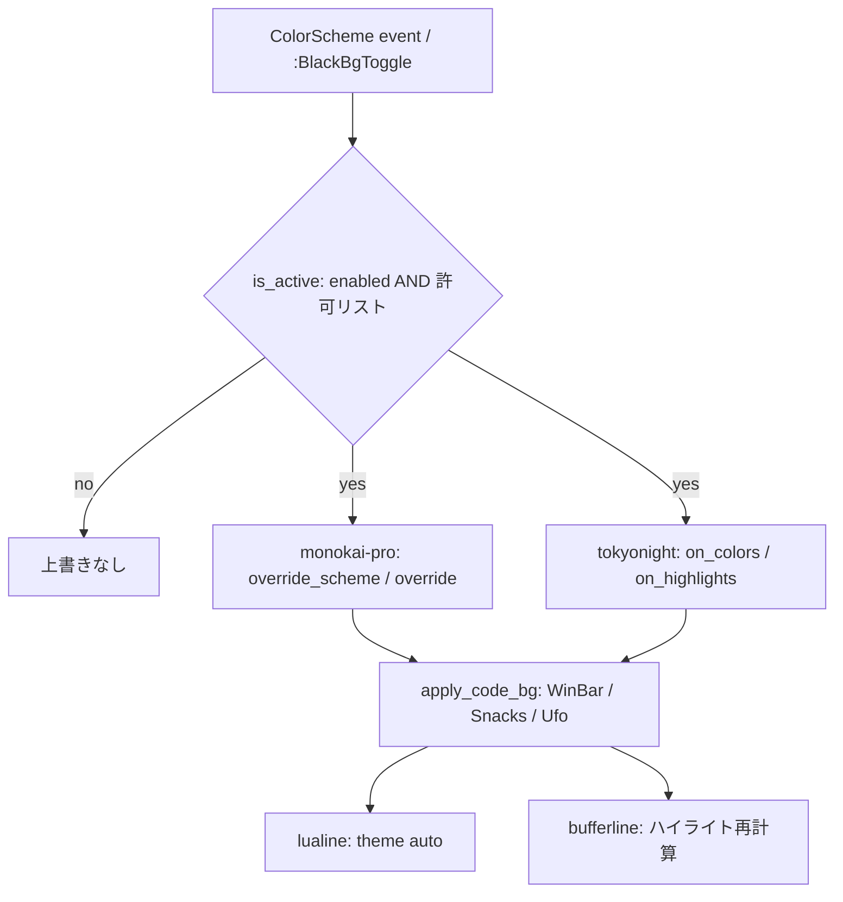

# 実装計画: 黒背景の上書きを許可リスト方式にし tokyonight にも適用する

## 元Issue
- #25: [Feature] 黒背景の上書きを許可リスト方式にし tokyonight にも適用する
- https://github.com/ryuma-1/dotfiles/issues/25

## 概要
`config/colors.lua` の `is_active()` を「monokai-pro 固定」から「許可リストに登録されたカラースキーム」の判定に変更する。tokyonight.nvim を追加し、tokyonight でも monokai-pro と同様に黒背景を適用する。あわせて `:BlackBgToggle` の再読込と lualine テーマを、現在のカラースキームに追従するよう一般化する。

注意：コードの読み取りは行わず、ご提示の情報のみに基づく計画である。実装時に各ファイルの実体を確認すること。

## 要件
- `config/colors.lua` に黒背景を適用するカラースキームの許可リストを置き、`is_active()` はそれで判定する。
- tokyonight（`tokyonight-night` / `storm` / `moon`）で、コード領域・フロート・WinBar・bufferline・lualine・Snacks picker などを黒背景にする。
- `tokyonight-day`（ライト）は対象外。
- `:BlackBgToggle` が tokyonight でも機能する。
- 許可リスト外のカラースキームでは黒の上書きを一切適用しない。
- monokai-pro 使用時の見た目は現状から変えない。
- lualine のテーマは現在のカラースキームに追従させる。
- テーマ側に背景を差し替えるオプションがあればそちらを優先する（tokyonight は `on_colors` / `on_highlights`）。不足分は `apply_code_bg()` の `nvim_set_hl` で補う。
- 確認事項：bufferline のハイライト再計算の要否、`overlay_bg`（`#262427`）のテーマ別化。

## 実装方針
1. **ブランチ**：`origin/issue-18-black-bg-monokai-toggle` から新規ブランチを作成する。PR の向き先も同ブランチにする。#19 の再編成（PR #26）は含まれないため、tokyonight.nvim は `nvim/lua/plugins/ui.lua` の monokai-pro の隣に追加する。
2. **許可リスト判定**：`colors_name` は `tokyonight-night` のようにバリアントが付く。そのため完全一致ではなく、次のどちらかで判定する。
   - 許可リストを「名前 → 判定（真偽値 or 関数）」にして、tokyonight だけ `tokyonight-day` を除外する。
   - 前方一致で判定し、day を明示的に除外する。

   `enabled` フラグとの AND は従来どおり維持する。
3. **テーマごとの色**：`overlay_bg` はテーマ別に持てる構造（許可リストの値にテーマ設定を持たせる等）にするか検討する。monokai-pro は現状値 `#262427` を維持する。
4. **tokyonight 側の適用**：`on_colors` で `bg` / `bg_dark` / `bg_float` などを `colors.code_bg` に差し替える。`on_highlights` は必要最小限にする。`on_colors` の適用は `is_active` 相当の条件（`enabled` と day 除外）でガードする。これにより、トグルOFF時と許可リスト外では上書きされない。
5. **補完**：塗り残しは `apply_code_bg()` の `nvim_set_hl`（WinBar、Snacks picker、Ufo など）で補う。既存の処理がテーマ非依存になっているか確認する。
6. **トグル一般化**：`:BlackBgToggle` は `enabled` を反転したあと、`colors_name` が許可リスト内なら `vim.cmd.colorscheme(vim.g.colors_name)` で再読込する。許可リスト外では「適用されない」旨を通知する。
7. **lualine**：`theme` を `'auto'` にするか、`colors_name` から動的に解決する。ColorScheme 時に lualine を再読み込みしてテーマに追従させる。monokai-pro で見た目が変わらないことを確認する。
8. **bufferline**：ハイライトは setup 時に計算されるため、ColorScheme / トグル時に再計算が必要か確認し、必要なら再 setup するか `highlights` を関数化して対応する。

## 構成の変化

## タスク一覧
### 準備
- [x] `origin/issue-18-black-bg-monokai-toggle` から新規ブランチを作成する

### colors.lua
- [x] 許可リストを追加する（monokai-pro、tokyonight）
- [x] `is_active()` を許可リスト判定に変更する（tokyonight のバリアントに対応し、day は除外する）
- [x] （検討）`overlay_bg` をテーマ別に取得できるようにする。monokai-pro は `#262427` のままにする
- [x] `:BlackBgToggle` の再読込を、現在のカラースキームの再読込に一般化する。許可リスト外のメッセージも整える
- [x] `apply_code_bg()` の内容がテーマ非依存で動くか確認し、必要なら調整する

### plugins/ui.lua
- [x] tokyonight.nvim を monokai-pro の隣に追加する（`lazy` 設定は既存の流儀に合わせる）
- [x] tokyonight の `on_colors` / `on_highlights` で背景を黒に差し替える。条件は `colors` モジュールの判定を使う
- [x] lualine の `theme` を現在のカラースキームに追従させる（ColorScheme 時の再読み込みを含む）
- [x] bufferline のハイライトを、カラースキーム変更とトグルの際に再計算する

### plugins/edit.lua ほか
- [x] navic / ufo / snacks の `colors.apply_code_bg()` 呼び出しが tokyonight でも機能するか確認し、必要なら調整する

### 検証（headless nvim）
- [x] `tokyonight-night` / `storm` / `moon` で `Normal`、`NormalFloat`、`WinBar`、`SnacksPicker`、bufferline、lualine のハイライトの bg が `#000000` になることを確認する
- [x] `tokyonight-day` と許可リスト外のスキームで、黒の上書きが入らないことを確認する
- [x] monokai-pro で、変更前後の主要ハイライトの値が同一であることを確認する
- [x] `:BlackBgToggle` を ON から OFF、OFF から ON と切り替えて、両テーマで動作することを確認する
- [x] カラースキームを切り替えたとき、lualine と bufferline が追従することを確認する

## リスク・確認事項
- tokyonight は `on_colors` の適用がロード時であり、トグル時は `colorscheme` の再読込が必須になる。再読込中のちらつきや、`setup` 済みオプションとの整合に注意する。
- lualine を `auto` にしたとき、monokai-pro の配色が現状と完全に一致しない可能性がある。その場合は monokai-pro だけ明示指定にフォールバックする。
- bufferline の再計算方法は、使用している bufferline のバージョン依存になる。
- PR は #24 のブランチ向けになる。#24 が先にマージされた場合は、向き先を main に変更する必要がある。
- #19（PR #26）が後でマージされると、`ui.lua` の tokyonight 定義の配置でコンフリクトする可能性がある。
