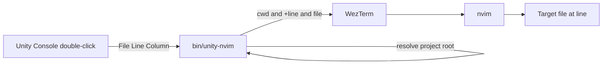

# 実装計画: Unity Console のログから nvim を開く起動ラッパー（bin/unity-nvim）の追加

## 元Issue
- #32: [Bug] Unity Console のログから nvim を開くとホームディレクトリが開かれる
- https://github.com/ryuma-1/dotfiles/issues/32

## 概要
Unity の External Script Editor には，現在 nvim バイナリが直接指定されている．
Unity は GUI アプリとして nvim を起動するため，端末がなく，作業ディレクトリが `~` になる．
その結果，`~` がディレクトリとして開かれると推測される．
Unity の `$(File)` と `$(Line)` を受け取り，WezTerm 上で `nvim +<line> <file>` を起動するラッパースクリプト `bin/unity-nvim` を，このリポジトリに追加する．
Unity 側の設定値（パスと引数テンプレート）は，PR 説明に記載する．

## 要件
- Unity Console のログをダブルクリックすると，該当ファイルが nvim で開く．
- カーソルが該当行へ移動する．
- ラッパーは，このリポジトリに追加する（`bin/unity-nvim`）．Unity はそのラッパーを指す．
- 新規依存は導入しない．
- README は変更しない．
- コメントは英語で書く．主要な関数には doc comment を付ける．インラインコメントは対象コードの上の行に書く．
- 既存の `:UnityLog` と `<leader>ue` の動作は変えない．

## 調査結果（リポジトリ内で確認できた事実）
- リポジトリ内に，Unity 用のラッパーや `bin/`，`scripts/` ディレクトリは存在しない．
- `/Users/ryuma/git/dotfiles/nvim/init.lua:29-32` は netrw を無効化している．
- `/Users/ryuma/git/dotfiles/nvim/lua/plugins/edit.lua:188-198` では，nvim-tree が `lazy = false` かつ `opts = {}` で，ディレクトリ引数を乗っ取る．
  - これが，`~` がツリー表示で開く仕組みである．
- `/Users/ryuma/git/dotfiles/nvim/lua/config/base.lua:70-88` は，`BufRead` 後の `BufWinEnter` で，`g`"` によりカーソル位置を復元する．
  - コマンドラインの `+<line>` を上書きする可能性がある．
- 端末の設定は `wezterm.lua` と `config.ghostty` の 2 種類があり，ユーザー確認により WezTerm を使う．
- `.zshrc` には Unity CLI の読み込み（`.unity/env`）のみがある．
  - nvim 起動の仕組みや引数処理は含まれない．

## 実装方針
- ラッパーは POSIX 互換の shell で書く．
  - 新規依存を避けるため，macOS 標準のコマンドと WezTerm の CLI のみを使う．
- 引数
  - 第 1 引数: ファイルパス（`$(File)`）
  - 第 2 引数: 行番号（`$(Line)`）．省略可．
  - 第 3 引数: 列番号（`$(Column)`）．受け取るだけで，使用はしない．
- 処理の流れ
  1. ファイル引数が空なら，エラーを標準エラーに出力して非 0 で終了する．黙って `~` を開かない．
  2. 相対パスなら絶対パスに解決する．
  3. 行番号が数字でなければ無視し，`+<line>` を付けずに開く．
  4. 作業ディレクトリは，ファイルの親を上方向にたどり，`Assets` ディレクトリを持つ最初のディレクトリ（Unity プロジェクトルート）にする．見つからなければファイルの親ディレクトリにする．
  5. `wezterm start --cwd <dir> -- nvim +<line> -- <file>` を実行する．
- 引数はスペースを含んでも壊れないよう，クォートして渡す．
- WezTerm が見つからない場合は，エラーを出して終了する．
- GUI 起動の Unity から呼ばれるため，PATH が最小になる．
  - `wezterm` と `nvim` は，`/opt/homebrew/bin` や `/Applications/WezTerm.app/Contents/MacOS` を PATH に補って解決する．
- 実行権限を付ける（`chmod +x`）．
- Unity 側の設定値（PR 説明に記載する）
  - External Script Editor: `/Users/ryuma/git/dotfiles/bin/unity-nvim`
  - External Script Editor Args: `"$(File)" $(Line)`
    - Args が空の場合は，`$(File)` が渡らないため，ラッパーがエラーを出力する．

## 構成の変化

## タスク一覧
### ラッパー実装
- [x] `/Users/ryuma/git/dotfiles/bin/unity-nvim` を新規作成する．doc comment と英語のコメントを付ける．
- [x] ファイル引数が空のとき，エラー終了する．
- [x] 相対パスを絶対パスに解決する．
- [x] 行番号が数字のときのみ，`+<line>` を付ける．
- [x] `Assets` ディレクトリを持つ親をプロジェクトルートとして検出し，作業ディレクトリにする．見つからなければファイルの親にする．
- [x] WezTerm で nvim を起動する．
- [x] GUI 起動時の最小 PATH に備え，必要なパスを補う．
- [x] 実行権限を付ける．

### 動作確認
- [x] ターミナルからラッパーを直接実行し，指定ファイルの指定行が開くことを確認する．
- [x] 引数なし，行番号なしの場合に，期待どおりの動作（エラー終了／行指定なし）になることを確認する．
- [x] Unity の Console のエラー，警告，スタックトレースの各行をダブルクリックし，該当ファイルの該当行が開くことを確認する（ユーザー実施）．
- [x] `nvim/lua/config/base.lua` のカーソル位置復元が，`+<line>` を上書きしていないことを確認する．
  - 上書きしていたら，起動引数の行指定を優先するよう，別途修正する．
- [x] ファイル名やプロジェクトパスにスペースを含む場合に動作することを確認する．
- [x] `:UnityLog` と `<leader>ue` が従来どおり動くことを確認する．
- [x] `nvim <dir>` が nvim-tree で開く既存動作を維持していることを確認する．

### PR 説明
- [x] Unity 側の設定値（上記のパスと Args テンプレート）を，PR 説明に記載する．README は変更しない．

## リスク・確認事項
- Unity の Args テンプレートが，現在どう設定されているかは不明である．
  - PR 説明の値（`"$(File)" $(Line)`）に設定し直してもらう前提とする．
- Unity が File に相対パス（`Assets/...`）を渡す場合，GUI 起動時の cwd は `~` になるため，解決結果は動作確認で確認する．
- スコープ外（必要ならユーザー判断で追加）:
  - 起動中の nvim に `--server`／`--remote` で接続して再利用する．
  - `$(Column)` による列移動．
- WezTerm の `start --cwd` の仕様は，インストールされているバージョンで確認が必要である．
- `bin/` の新設は，リポジトリ構成の追加である．

## 関連ファイル
- `/Users/ryuma/git/dotfiles/bin/unity-nvim`（新規）
- `/Users/ryuma/git/dotfiles/wezterm.lua`
- `/Users/ryuma/git/dotfiles/nvim/lua/config/base.lua`
- `/Users/ryuma/git/dotfiles/nvim/lua/plugins/edit.lua`
- `/Users/ryuma/git/dotfiles/nvim/init.lua`
