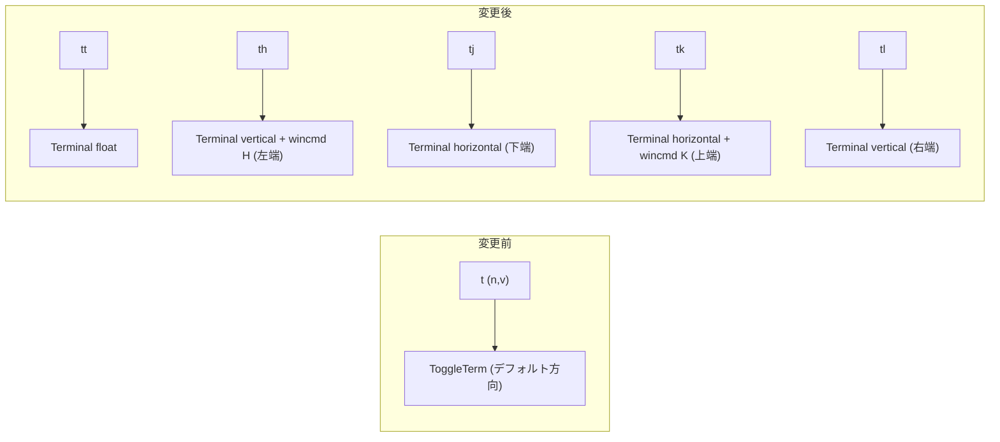

# 実装計画: ターミナル起動キーマップを `<leader>tt`（フロート）/ `<leader>th,tj,tk,tl`（端に分割）へ変更

## 元Issue
- #4: [Feature] ターミナル起動キーマップを leader t t（フロート）/ leader t hjkl（端に分割）に変更したい
- https://github.com/ryuma-1/dotfiles/issues/4

## 概要
`nvim/lua/plugins/edit.lua` の toggleterm.nvim 設定で，単一の `<leader>t`（`ToggleTerm`）を廃止する．代わりに `<leader>tt` でフロート，`<leader>th/tj/tk/tl` で左/下/上/右の画面端にターミナルを開けるようにする．
toggleterm の `direction` には left/top がないため，左と上は `Terminal` インスタンスの `on_open` で `wincmd H` / `wincmd K` を実行して実現する．同じキーをもう一度押すと閉じるトグル動作にする．

## 要件
- `<leader>tt` でフロートのターミナルを開く．
- `<leader>th` は左，`<leader>tj` は下，`<leader>tk` は上，`<leader>tl` は右の画面端にターミナルを開く．
- 旧 `<leader>t`（mode `n`,`v`）は削除する．`<leader>t` が prefix になるため，残すと `timeoutlen` 待ちの遅延が発生する．
- 調査結果:
  - `nvim/` 配下で `<leader>t` 系の他のキーマップは，edit.lua:117 以外に存在しない．
  - which-key 系のプラグインや group 定義は存在しない．
  - `timeoutlen` の設定はない．
  - `mapleader` は Space．
  - 既存の `<C-t>`（float），`<leader>yt`（horizontal size=10），`<leader>yy`（vertical size=50）は Issue の対象外なので維持する．
  - リポジトリ直下の `/home/ikeda-r/git/dotfiles/init.lua:550` にも `<leader>t`（`Translate`）がある．ただしこれは `nvim/` 配下の設定ではない．

## 実装方針
複雑度は「単純」寄りで，変更は 1 ファイル（`nvim/lua/plugins/edit.lua`）に収まる．

1. **各方向を別インスタンスの `Terminal` にする．**
   - `require('toggleterm.terminal').Terminal` で float / left / bottom / top / right の 5 つを定義する．
   - 別インスタンスにする理由は，方向ごとに独立したセッションを持てて，同じキーで開閉トグルできるためである．
   - 1 つの共有ターミナルの方向を切り替える案は，方向切替のたびに再配置が必要になり，トグルの意味も曖昧になるため採用しない．
2. **各方向の設定．**
   - float: `direction = 'float'`．
   - bottom: `direction = 'horizontal'`．size は既存 `<leader>yt` と揃えて 10 前後にする．
   - right: `direction = 'vertical'`．size は既存 `<leader>yy` と揃えて 50 前後にする．
   - left: `direction = 'vertical'` にして `on_open` で `vim.cmd('wincmd H')` を実行する．
   - top: `direction = 'horizontal'` にして `on_open` で `vim.cmd('wincmd K')` を実行する．
   - `wincmd H/K` は，開いたウィンドウを画面の左端/上端に移動して全幅・全高に広げる．
3. **キーマップは `keys` テーブルに `function() term:toggle() end` として定義する．**
   - mode は旧 `<leader>t` と同じ `{'n','v'}` にする．
   - `keys` による lazy load は維持する．
   - `Terminal` インスタンスは `require('toggleterm.terminal')` が必要になる．そのため，遅延ロードされる `config` 内で生成し，`keys` のコールバックからは `config` 側で保持したテーブルを参照するか，コールバック内で初回生成する．
   - プラグイン未ロードの状態でキーが押されても，lazy がロードしてから実行される点を確認する．
4. **`on_open` での配置後のサイズ調整を確認する．**
   - `wincmd H/K` 後に幅/高さが意図通りか確認する．
   - 必要なら `vim.cmd('vertical resize N')` / `resize N` を追加する．
5. **旧 `<leader>t` の行を削除する．**
6. **コメント規約に従う．**
   - 新規の関数・テーブルには doc comment を付ける．
   - コメントは why を書く．例: `direction` に left/top がないため `wincmd` で端に寄せる，旧 `<leader>t` を残すと prefix 待ちが発生する，など．
   - 日本語コメントは「，」「．」を使う．
   - コメントは行の上に別行で書く．
7. **既存の `TermOpen` の `<ESC>` マッピングと，`<C-t>` の理由コメントは変更しない．**

## 構成の変化

## タスク一覧
### キーマップ・ターミナル定義（`nvim/lua/plugins/edit.lua`）
- [x] `config` 内で `Terminal` を 5 つ定義する（float / left / bottom / top / right）．left は `on_open` で `wincmd H`，top は `on_open` で `wincmd K` を実行する．
- [x] `keys` に `<leader>tt`, `<leader>th`, `<leader>tj`, `<leader>tk`, `<leader>tl` を追加する（mode `{'n','v'}`，`desc` 付き，各 `term:toggle()` を呼ぶ）．
- [x] 旧 `{ '<leader>t', '<CMD>ToggleTerm<CR>', ... }`（117 行目）を削除する．
- [x] 既存の `<C-t>`, `<leader>yt`, `<leader>yy`, `TermOpen` autocmd は変更しないことを確認する．
- [x] doc comment と why コメントを規約通りに追加する．

### 検証
- [x] headless での読み込み確認: `nvim --headless "+Lazy! load toggleterm.nvim" +qa` でエラーがないことを確認する．
- [x] headless でのキーマップ確認: `nvim --headless "+lua print(vim.fn.maparg('<leader>tt','n'))" +qa` などで，5 キーが登録済みで旧 `<leader>t` 単体が存在しないことを確認する．
- [x] 手動確認: 各キーで float / 左 / 下 / 上 / 右の端に開くこと，同じキーで閉じること，別方向のターミナルが共存できることを確認する．
- [x] 手動確認: `<leader>t` 単体で遅延が発生しないこと，`<C-t>`, `<leader>yt`, `<leader>yy` が従来通り動作することを確認する．

## リスク・確認事項
- **`wincmd H/K` によるレイアウト**
  - `on_open` は，ウィンドウ生成後・ターミナル開始時のタイミングで呼ばれる．
  - 閉じて再度開くたびに再実行される．`wincmd` の結果とサイズ指定が競合しないか，実機確認が必要．
  - NvimTree など既存の縦分割との並びで，左端が NvimTree かターミナルかは `wincmd H` の挙動次第で決まる．許容できるか確認する．
- **サイズの初期値**
  - Issue にサイズ指定はない．既存の `<leader>yt`（10）/`<leader>yy`（50）に揃える案でよいか確認する．
- **`<leader>t` の mode `v` を新キーにも引き継ぐか**
  - 計画では `{'n','v'}` を維持する．Issue に明記はないが，旧定義を踏襲する．
- **重複機能**
  - `<leader>yt`/`<leader>yy` は新しい `tj`/`tl` と機能が重複する．Issue の対象外なので削除せず残し，整理は別途判断とする．
- **リポジトリ直下 `init.lua` の `<leader>t`（Translate）**
  - `nvim/` 配下とは別ファイルで，ターミナルとは無関係．
  - このファイルが実際に読み込まれる場合は，`<leader>t` が prefix になるため Translate 側も影響を受ける．
  - `/home/ikeda-r/git/dotfiles/init.lua` が現在の Neovim 設定として有効か，レガシーかを実装時に確認する．今回の変更範囲外だが認識しておく．
- **lazy-lock.json**
  - 新規依存は追加しない．プラグイン更新は不要．

関連ファイル:
- /home/ikeda-r/git/dotfiles/nvim/lua/plugins/edit.lua
- /home/ikeda-r/git/dotfiles/init.lua
