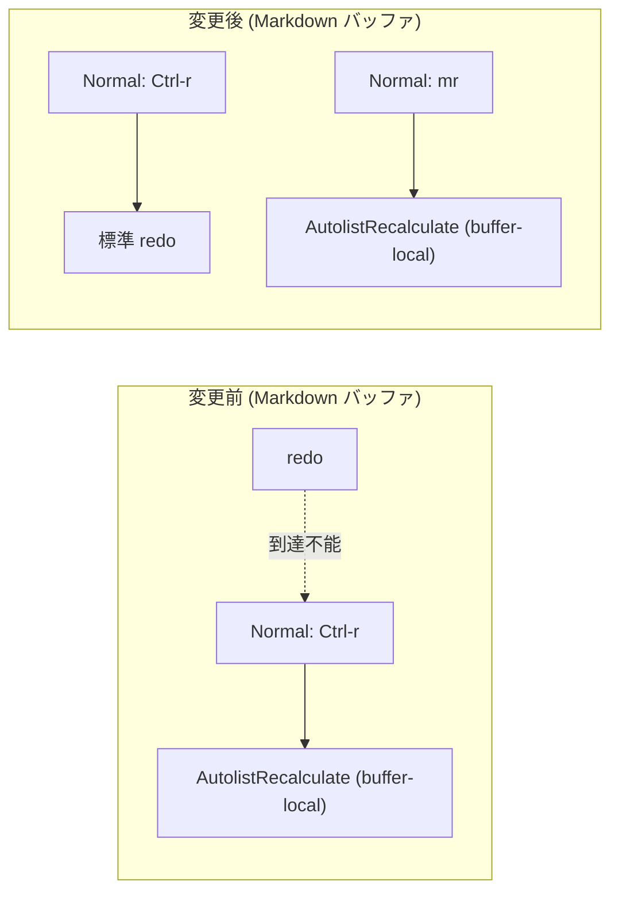

# 実装計画: Markdown で `Ctrl-r` の redo が効かない問題の修正（AutolistRecalculate のキー変更）

## 元Issue
- #5: [Bug] Markdown ファイルで Ctrl-r による redo が動作しない
- https://github.com/ryuma-1/dotfiles/issues/5

## 概要
`nvim/after/ftplugin/markdown.lua` L13 で，Normal モードの `<C-r>` にバッファローカルで `AutolistRecalculate` を割り当てている．このため Markdown バッファだけ Vim 標準の redo が上書きされ，使えなくなっている．
`<C-r>` の割り当てを外して redo を標準動作に戻す．`AutolistRecalculate` は，Markdown 既存の `m` 系キー規約に沿った `mr` に移して機能を残す．

## 要件
- Markdown バッファの Normal モードで `<C-r>` が標準の redo として動作する．
- Markdown 以外のファイルの挙動は変えない（もともと問題なし）．
- `AutolistRecalculate`（番号付きリストの再採番）の機能は失わない．
- 新しいキーは既存のキーマップ・leader 群と衝突させない．

## 実装方針
原因は，autolist.nvim の README が例として示している `vim.keymap.set("n", "<C-r>", "<cmd>AutolistRecalculate<cr>")` をそのまま取り込んだことにある．README の例は redo を犠牲にしており，この設定では標準機能と衝突する．

### 調査結果
- **ftplugin**: `nvim/after/ftplugin/markdown.lua` L10-13 が autolist 関連の buffer-local キーマップ（`<CR>`, `o`, `O`, `<C-r>`）を定義している．`<C-r>` だけが標準コマンドを潰している．
- **プラグイン定義**: `nvim/lua/plugins/lsp.lua` L184-188 で `gaoDean/autolist.nvim`（`ft = 'markdown'`）を `require('autolist').setup()` の既定設定で読み込んでいる．
- **自動再採番の有無**: インストール済みの `~/.local/share/nvim/lazy/autolist.nvim` の README を確認した．
  - 自動で再採番されるのは，`AutolistNewBullet`（`<CR>`/`o`/`O`）と `AutolistTab`/`AutolistShiftTab` の内部処理だけである．
  - `>>`，`<<`，`dd`，Visual の `d` での再採番は README のオプション例であり，このリポジトリでは未設定．
  - したがって `dd` や貼り付けで番号がずれた場合に手動で直す手段として，`AutolistRecalculate` のキーマップは有用．削除は機能低下になるため採用しない．
- **移行先キーの候補調査**
  - `<leader>` と `<localleader>` はどちらも空白（`nvim/init.lua` L27，`nvim/lua/config/keymaps.lua` L2）で同一である．`<localleader>` を使っても `<leader>` 群と衝突判定は同じになる．
  - `<leader>r` は Translate（`nvim/lua/plugins/edit.lua` L88，`n`/`v`）で使用済みである．`<leader>r` は使えず，`<leader>r?` 系にすると Translate が timeoutlen 待ちになる．
  - リポジトリ内に which-key の設定は存在しない．グループ定義との衝突を考慮する必要はない．
  - Markdown 専用キーは，VSCode Markdown All in One に合わせた `m` 系（`mb`/`mi`/`ms`/`mm`/`mc`/`mvv`/`mvk`）で統一されている．`m` の標準機能（マーク設定）は，既存の `m` 系キーで既に上書き済みである．
  - `mr` は現行の Markdown キーマップ・グローバルキーマップに存在せず，`mv*` とも接頭辞が競合しない．
- **結論**: `<C-r>` の割り当てを削除し，Normal モードの `mr` に `AutolistRecalculate` を割り当てる．
  - 理由: Markdown 専用キーは `m` 系という既存規約に一致する．
  - 理由: `<leader>r`（Translate）との競合を避けられる．
  - 理由: `r` は Recalculate の頭文字で覚えやすい．
- `desc` は既存の `Markdown: ...` 形式を維持する（`Markdown: Recalculate List`）．
- `silent = true` は他の `m` 系にそろえて付与する．

### 変更イメージ（`nvim/after/ftplugin/markdown.lua` L13）
```lua
-- Before
vim.keymap.set('n', '<C-r>', '<cmd>AutolistRecalculate<CR>', { buffer = true, desc = 'Markdown: Recalculate List' })

-- After
-- <C-r> は Vim 標準の redo と衝突し Markdown で redo できなくなるため使わず，
-- 他の Markdown 専用キー (m 系) に揃えて mr に割り当てる．
vim.keymap.set('n', 'mr', '<cmd>AutolistRecalculate<CR>', { buffer = true, silent = true, desc = 'Markdown: Recalculate List' })
```

## 構成の変化


## タスク一覧
### 実装
- [x] `nvim/after/ftplugin/markdown.lua` L13 の `<C-r>` バッファローカルマッピングを削除する
- [x] 同ファイルに Normal モード `mr` → `<cmd>AutolistRecalculate<CR>`（`buffer = true, silent = true, desc = 'Markdown: Recalculate List'`）を追加する（L10-12 の autolist 関連キーマップの並びに置く）
- [x] 変更箇所に，なぜ `<C-r>` を避けたかを説明するコメントを追加する（日本語，「，」「．」を使用，WHY を書く）

### 検証
- [x] headless でキーマップを確認する．`nvim --headless` で Markdown ファイルを開き，`ft=markdown` で `after/ftplugin` が読まれた状態で，以下を確認する．
  - `vim.fn.maparg('<C-r>', 'n', false, true)` が空である（buffer-local 定義が存在しない）．
  - `vim.fn.maparg('mr', 'n', false, true)` の `rhs` が `<cmd>AutolistRecalculate<CR>` で，`buffer = 1` である．
- [x] redo の実動作を確認する．Markdown バッファで編集，`u`，`<C-r>` の順に実行し，編集が復元されることを確認する（headless では `normal! ...` と `feedkeys`，または手動で確認する）．
- [x] `mr` の動作を確認する．番号付きリスト（`1.` `2.` `3.`）の途中行を `dd` で削除して番号を飛ばし，`mr` で連番に戻ることを確認する．
- [x] 非 Markdown ファイル（`.lua` など）で `<C-r>` が標準 redo のままであることを確認する．
- [x] `mb`/`mi`/`ms`/`mm`/`mc`/`mvv`/`mvk` が従来どおり動作すること，`:messages` に起動時エラーがないことを確認する．

## リスク・確認事項
- `mr` は標準のマーク `r` の設定を上書きする．ただし，既存の `mb`/`mi`/`ms`/`mm`/`mc` も同様にマーク設定を上書きしており，同一方針の範囲内である．Markdown バッファに限った buffer-local 定義なので，影響も Markdown に限られる．
- `m` 接頭辞の複数文字マッピング（`mv` 系など）があるため，`m` 単独入力は `timeoutlen` 待ちになる．これは既存の挙動であり，`mr` の追加で悪化しない（`mr` は 2 キーで確定する）．
- 元のキー操作（`Ctrl-r` で再採番）に慣れている場合は，`mr` に移行する必要がある．この点は README を含むドキュメントに記載しない（README/ドキュメントの変更は禁止事項のため）．
- ユーザー確認事項: 移行先キーを `mr` としてよいか．別案は `<leader>mr` だが，`<leader>` と `<localleader>` がどちらも空白で，`m` 系規約から外れるため採用しなかった．
