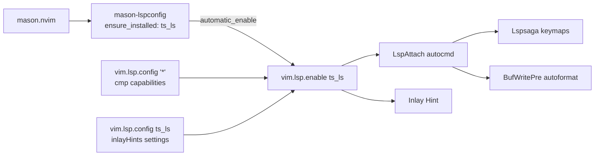

# 実装計画: TypeScript / JavaScript の LSP 対応

## 元Issue
- #8: [Feature] TypeScript の LSP に対応する
- https://github.com/ryuma-1/dotfiles/issues/8

## 概要
`nvim/lua/plugins/lsp.lua` に TypeScript / JavaScript 用の言語サーバー（`ts_ls`）を追加し，`.ts` / `.tsx` / `.js` / `.jsx` を開いたときに LSP がアタッチされるようにする．
補完，診断，Lspsaga キーマップ，保存時フォーマット，Inlay Hint は既存の共通ロジックをそのまま使う．新規プラグインは追加しない．

## 要件
- TS / JS ファイルで LSP がアタッチされること．
- 以下が既存の他言語と同様に動くこと．
  - nvim-cmp による補完と診断表示
  - Lspsaga キーマップ（`gd` / `gr` / `grn` / `gca` / `gs` など）
  - `BufWritePre` による保存時自動フォーマット
  - Inlay Hint の表示
- 新規プラグインは，ユーザーの明示的な承認なしに導入しない．
- コードコメントは英語で書き，主要な構造の前に doc comment を付ける．

## 調査結果（現状）
- `mason-lspconfig.nvim` は `automatic_enable = { exclude = { "rust_analyzer" } }` の設定になっている．
  - Mason 経由でインストール済みのサーバーは自動で `vim.lsp.enable` される．
  - `ensure_installed` は未設定．そのため `ts_ls` は自動では入らず，現状は手動で `:MasonInstall` する必要がある．
- `nvim-lspconfig` の `config` 内に共通設定がある．
  - `vim.lsp.config('*', { capabilities = cmp_nvim_lsp... })` で cmp 連携している．
  - `vim.lsp.inlay_hint.enable()` はグローバルに有効化されている．
  - `LspAttach` autocmd で Lspsaga キーマップを設定している．
  - 同じ autocmd で `BufWritePre` の自動フォーマットも設定している．`textDocument/formatting` を対応していて `willSaveWaitUntil` を持たないクライアントが対象．
- 上記はすべて言語非依存なので，`ts_ls` が有効になれば自動的に適用される．
- ただし `ts_ls` の Inlay Hint は，サーバー側の設定（`typescript.inlayHints.*` / `javascript.inlayHints.*`）で明示的に有効にしないと返ってこない．ここは追加設定が必要．
- `lazy-lock.json` には `nvim-lspconfig`（master）と `mason-lspconfig` がある．Neovim 0.11 以降の `vim.lsp.config` / `vim.lsp.enable` 方式で運用されている．
- `after/ftplugin` には lua / markdown / tex のみがある．TS 向けのインデント設定はない．`base.lua` の 4 スペースが適用される．Issue の範囲外なので触らない．
- `ts_ls` はデフォルトでフォーマット機能を持つ．保存時フォーマットは動くが，Prettier / ESLint 連携は Issue の範囲外．

## 実装方針
複雑ではない．実質 1 ファイル（`lsp.lua`）の変更で済む．
1. `vim.lsp.config('ts_ls', { settings = ... })` で，TS / JS の Inlay Hint 各項目を有効化する．
   - 設定は `nvim-lspconfig` の `config` 内，`vim.lsp.config('*', ...)` の直後に置く．
   - 既存スタイルに合わせ，doc comment を英語で付ける．
2. `ts_ls` を Mason で導入する．次のどちらかを実装時に選ぶ（推奨は A）．
   - A（推奨）: `mason-lspconfig` の `opts` に `ensure_installed = { "ts_ls" }` を追加する．新環境でも自動導入され，`automatic_enable` で有効化される．新規依存は増えない．
   - B: `:MasonInstall typescript-language-server` を手動で実行する．dotfiles の再現性は下がるので，A を優先する．
3. 補完，キーマップ，フォーマット，診断は共通の `LspAttach` ロジックに任せ，追加変更はしない．
4. Node.js が必要になる．`typescript-language-server` は Node と `typescript` を前提とする．これはランタイムの前提であり，プラグイン追加ではない．

## 構成の変化

## タスク一覧
### 設定変更（`nvim/lua/plugins/lsp.lua`）
- [x] `mason-lspconfig` の `opts` に `ensure_installed = { "ts_ls" }` を追加する．既存の `automatic_enable` の `exclude` は維持する．
- [x] `nvim-lspconfig` の `config` 内に `vim.lsp.config('ts_ls', { settings = { typescript = { inlayHints = ... }, javascript = { inlayHints = ... } } })` を追加する．
  - 設定項目: `includeInlayParameterNameHints`，`includeInlayFunctionParameterTypeHints`，`includeInlayVariableTypeHints`，`includeInlayPropertyDeclarationTypeHints`，`includeInlayFunctionLikeReturnTypeHints`，`includeInlayEnumMemberValueHints`
  - 値の選択（"all" / "literals" など）は，ノイズが多すぎないものに調整する．
- [x] 追加箇所に，why を説明する英語の doc comment を付ける（「ts_ls は明示しないと Inlay Hint を返さない」など）．
- [x] 既存の `LspAttach` / cmp capabilities / Lspsaga キーマップ / フォーマット処理は変更しない．

### 動作確認
- [x] 前提を確認する．`node --version` と `npm --version` が使えること．
- [x] `nvim --headless "+Lazy! sync" +qa` 後，`nvim --headless "+MasonInstall typescript-language-server" +qa`（または `ensure_installed` による自動導入）で `ts_ls` が導入されることを確認する．
- [x] `:Mason` で `typescript-language-server` が Installed になっていることを確認する．
- [x] 最小 TS プロジェクトを用意する（`tsconfig.json` と `test.ts`）．
- [x] `nvim test.ts` を開き，`:LspInfo`（または `:checkhealth vim.lsp`）で `ts_ls` がアタッチされていることを確認する．
- [x] headless で確認する．`nvim --headless test.ts "+lua vim.wait(3000, function() return #vim.lsp.get_clients({name='ts_ls'})>0 end); print(#vim.lsp.get_clients({name='ts_ls'}))" +qa`
- [x] `.js` / `.tsx` / `.jsx` でも同様にアタッチされることを確認する．
- [x] 以下を手動で確認する．
  - 補完（nvim-cmp に LSP 候補が出る）
  - 型エラーの診断表示
  - `gd` / `gr` / `grn` / `gca` / `gs` / `g[` / `g]`
  - `:w` での自動フォーマット（`AutoFormatToggle` で切り替え可能）
  - Inlay Hint の表示（`InlayHintToggle` / `<leader>uh` で切り替え可能）
- [x] 既存言語（Lua や C# など）の挙動が変わっていないことを確認する．`:checkhealth` にエラーが増えていないことを確認する．

## リスク・確認事項
- 新規プラグインの追加はなし．`ensure_installed` は既存の `mason-lspconfig` の機能なので，依存は増えない．
- `ts_ls` を使うには Node.js が必要．環境に無い場合は導入が別途必要．
- `tsserver` は `nvim-lspconfig` で `ts_ls` に改名されている．lock されている `nvim-lspconfig`（master）と `mason-lspconfig` が `ts_ls` を認識するか，実装時に確認する．
- `ts_ls` のフォーマットは標準のもので，Prettier / ESLint とは連携しない．プロジェクトが Prettier を使う場合，整形結果が食い違う可能性がある．これらの連携は Issue の範囲外なので，計画に含めない．
- `vim.lsp.inlay_hint.enable()` は既にグローバル有効．表示が多すぎる場合は，Inlay Hint の各設定値で調整する．
- TS ファイルには `after/ftplugin` が無く，インデントは 4 スペースになる．Issue の範囲外なので現状維持．
- `deno` プロジェクトでは `ts_ls` と `denols` が競合し得るが，Issue に記載がないため対象外．

## 関連ファイル
- `nvim/lua/plugins/lsp.lua`（変更対象）
- `nvim/lazy-lock.json`（参照のみ．プラグイン追加がないため変更不要の見込み）
- `nvim/lua/plugins/ai.lua`（nvim-cmp の設定．参照のみ）
- `nvim/lua/plugins/edit.lua`（`<leader>uh` の Inlay Hint トグル．参照のみ）
